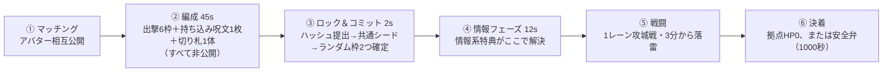

# 一本道の攻城戦

**にゃんこ大戦争型の1レーン攻城戦、1v1。**
アバターが拠点そのもので、ダメージはアバターに入る。相手のアバターのHPを
0にすれば勝ち。

この文書が設計書で、`game/` に**動くもの**が入っている ――
決定論的なシミュレータ、遊べる試遊版、Web版、data の検算器、仮のドット絵の生成器。

**遊ぶだけなら何も要らない。** `game/web/out/index.html` をブラウザで開けば動く
（1枚で完結していて、data も仮絵もその中に入っている）。

```console
$ pip install -r requirements.txt
$ python3 -m game.play                            # 手元で遊ぶ（14章）
$ python3 -m game.engine --a balanced --b greed   # AI同士で1試合（12章）
$ python3 game/tools/validate.py                  # data が約束を守っているか
$ python3 game/tools/balance.py                   # 試合そのものを測る（12.4・12.5）
$ python3 game/tools/art_brief.py                 # 作画の依頼書（13章）
$ python3 game/tools/build_web.py                 # Web版を焼き直す（data を触ったら）
$ python3 game/tools/conform.py                   # Python と JS が一致しているか
$ python3 -m unittest discover -s game/tests -t . # 79件
```

| どこに | 何が |
| --- | --- |
| `README.md`（この文書） | 設計。ルールと、そのルールを選んだ理由 |
| [`ROADMAP.md`](ROADMAP.md) | 工程表。何を作らないと決めたかと、作る順番 |
| `game/data/*.json` | **調整対象の数値は全部ここ。** コードを触らずに回せる |
| `game/engine/` | シミュレータ（決定論・固定タイムステップ） |
| `game/play/` | 手元の試遊版（pygame。**Python側で外の物を使うのはここだけ**） |
| `game/web/` | Web版（engine と試遊版の JS 移植。**依存なし**） |
| `game/tools/` | 検算器・**バランス計測器**・仮絵の生成器・Web版の焼き込み・一致試験（どれも依存なし） |
| `game/art/` | アート指針・パレット・仮絵・**作画依頼書**（`BRIEF.md`） |
| `game/tests/` | 79件（標準ライブラリのみ） |

**実装は2つある**（Python と JS）。ずれると意味がないので、`conform.py` が
両方で同じ試合を回し、0.5秒ごとの盤面を**浮動小数点のビット単位**で突き合わせる。

数値は全部仮置きで、調整対象のものは `game/data/` に JSON で外に出してある
（コードを触らずに数字だけ回せる状態にしておく、が主旨）。

- [0. v0.1から変わったところ](#0-v01から変わったところ)
- [1. 試合の骨格](#1-試合の骨格)
- [2. ユニットの能力](#2-ユニットの能力)
- [3. 編成：6選択＋2ランダム](#3-編成6選択2ランダム)
- [4. 資金](#4-資金)
- [5. 呪文カード](#5-呪文カード)
- [6. 切り札](#6-切り札1試合1回)
- [7. アバターと特典](#7-アバターと特典)
- [8. 公平性と実装](#8-公平性と実装)
- [9. 調整プロセス](#9-調整プロセス)
- [10. 作る順番](#10-作る順番)
- [11. 未決の論点](#11-未決の論点)
- [12. シミュレータ](#12-シミュレータ)
- [13. 見た目](#13-見た目)
- [14. 試遊版](#14-試遊版)
- [15. Web版](#15-web版)

---

## 0. v0.1から変わったところ

ジャンルが確定したので、前提を置き直した。

| 何が | v0.1（仮定） | v0.2（確定） |
| --- | --- | --- |
| ジャンル | 1体を操作するアクション | **1レーン攻城戦**（にゃんこ大戦争型） |
| 勝利条件 | 4体KO先取 | **体力制。** 相手アバターのHPを0に |
| アバター | 戦わない。画面端に立つ | **拠点そのもの。ダメージを受ける** |
| 出撃8枠 | 順に出す持ち駒 | **出撃できるユニットの種類。** 何度でも出せる |
| 資源 | ゲージ（カード専用） | **資金1本。** 出撃・呪文・切り札・財布の育成が全部これを奪い合う（5章） |
| 切り札 | なし | **別枠1体、1試合1回** |
| 見切り | 相手のため攻撃に合わせる | 相手の**詠唱**に合わせる（窓は0.3秒のまま） |

**アバターが拠点になったのが一番大きい。** v0.1では「戦場に出ないのにアバターと
呼ぶのは据わりが悪い」と書いたが、その問題がまるごと消えた。アバターは
画面端に立っているどころか、**殴られている当事者**になる。

まだ仮定なのは、レーン数（1本）・戦闘の長さ（5分）・拠点HP（42000）・
資金の成長曲線（10段階）。どれも `game/data/match.json` にある。

**v0.3 で足したもの**（この版）:

| 何が | 前 | いま |
| --- | --- | --- |
| レーン | 120m（最長射程110mとほぼ同じ） | **240m ＝ 最長射程80mの3倍**（2.1・12.4） |
| コスト | 1〜10 | **1〜40。** 強さの差を値段だけで読める（2.5） |
| 系統 | 見た目だけの区分（人・獣・機械…） | **種族。** 特性が見るので編成の材料になる（2.9） |
| 特性 | 無し | **出撃コストにだけ効く3つ**（2.10） |
| 呪文 | すべて無条件 | **押し込まれてから開く札**を3枚（5.4） |
| 遠距離の範囲攻撃 | 死角なしで足元まで拾えた | **必ず死角を持つ＝遠方範囲**（2.1） |
| 味方どうし | 隊列間隔で詰まる | **詰まらない。立ち位置は射程が決める**（12.4） |
| 拠点への攻撃 | ユニットと貫通の枠を奪い合う | **帯が届いていれば必ず当たる**（12.4） |
| 拠点の落ち方 | 前線が破れた瞬間に消える（実測1秒未満） | **攻城口の上限。落とし切るのに15秒**（1.1・12.5） |
| 拠点HP | 10000 | **42000 ＝ 攻城口2800 × 15秒**（1.1） |

**v0.4 で足したもの**（この版）:

| 何が | 前 | いま |
| --- | --- | --- |
| 攻撃した後 | 攻撃間隔の余りがあるだけ | **後隙。** 動けず被弾1.5倍。振りかぶりが長いほど長い（2.3） |
| 高射程の当て方 | 一番手前の1体しか捉えられない | **前線起点。** 敵の最前列を起点に、そこから奥へ窓ぶんを貫く（2.1） |
| 1v1 | 安いキャラが高いキャラに勝てた（32組） | **値段が倍以上なら高いほうが勝つ**（261組で検査・12.6） |
| 安いキャラの射程 | 槍兵(4)が25m、鬼武者(35)の20mより長い | **値段で買うもの**に寄せた（槍兵13m・弩兵28m…） |
| 高射程キャラの体力 | 560〜760。届かれたら消える | **700〜900**。射程を買った意味が残る |
| 財布の上限の伸び | +3,+3,+4,+4,+5,+5,+5,+5,+6（頭打ち） | **+4〜+12。段が上がるほど大きい**（6→78・4.1） |
| 種族 | 特性が見るだけの材料 | **種族呪文**。固めた見返りが札で返る（5.5） |

**v0.5 で足したもの**（この版）:

| 何が | 前 | いま |
| --- | --- | --- |
| 決着 | 300秒で時間切れ、与ダメージ割合で判定 | **時間では決めない。** 3分を過ぎたら雷が盤面を壊す（1.2） |
| 呪文 | 資金とクールタイムの範囲で何度でも | **1試合3回まで。** 「いつ撃つか」が択になる（5.6） |
| 早送り | 起動時の `--speed` だけ | **試合中に `[` `]`。** ×0.5〜×8（14章） |
| 測り方 | 見本編成3種の総当たり | **編成を振って測れる**（`--rosters`）。引き分けの原因が分かれた（12.7） |
| 安全弁 | 900秒 | **1000秒。** 一度700秒にしたが、雷の伸びのバグ修正で真の引き分け4%の目安に戻した（1.3） |
| ノックバック中 | 下がりながら殴られ、敵の足も止めていた | **当たり判定が消える。** 殴られず、すり抜けられる（2.11） |
| 押し戻される側の体力 | 双剣1100・狂戦士1600・亡霊将2000 | **1500・2100・2700。** 往復に耐えるぶん（2.11） |
| 1v1の規則 | 261組すべてで高いほうが勝つこと | **傾向として85%以上。** 特性持ちは外す（2.6・12.6） |

---

## 1. 試合の骨格



戦闘中にやることは3つだけ。**資金を払ってユニットを出す**、
**カードを撃つ**、**特典を切る**。ユニットは自動で前進し、自動で戦う。

この骨格を決めている判断は3つ。

**(1) 体力制にした。** 撃破数ではなく拠点HP。押し込んだぶんだけ前に進む
という手触りが1レーン戦の面白さなので、「あと何体」ではなく
「あとどれだけ削れば」で表示する。時間切れは**与ダメージの割合**で決める。

**(2) 8枠は「持ち駒」ではなく「種類」。** 資金が続く限り、
**同じユニットを何体でも同時に出せる**。制限は3つだけ ――
資金、再出撃CD、場の総数（片側20体）。
だから抽選で来た2種類も、*出さないという選択肢がある*。
引き事故が敗北に直結しない。

**(3) 資源は資金1本にまとめた。** 出撃も呪文も切り札も、**同じ財布から払う**。

| 何に払うか | 何を決めるか |
| --- | --- |
| **出撃** | いま前線を厚くするか |
| **呪文** | いま流れを変えるか |
| **切り札** | 1試合1回をどこで切るか |
| **財布の育成** | 上の3つを、これから何倍やれるようにするか |

**v0.2 では時計を3本に分けていたが、1本にした。**
分けていた頃は「呪文はタダなので、クールタイムが明けたら撃つのが最適」に
なっていて、撃つ判断そのものに値段が付いていなかった（11章）。
いまは**呪文1枚がユニット1〜数体ぶん**なので、
「この呪文を撃つか、その資金で壁を並べるか」が毎回の択になる。

**育てている間は何も出せない**（4.3）ので、財布を伸ばす判断だけは
時間の勝負になる。にゃんこ大戦争の働きネコと同じ役割。

### 1.1 拠点は一撃では落ちない ―― 攻城口の上限

帯が敵拠点に届いた者は全員が拠点を削る。ただし**削れる速さには上限がある**
（`combat.siege_cap_dps` ＝ 2800）。取り付ける口は限られているので、
20体を寄せても数体ぶんより速くはならない。

```
拠点HP 42000 ÷ 攻城口 2800 = 15秒
```

**この15秒が、押し切られる側が押し返すための時間そのもの。**
上限が無かった頃は、前線が破れた瞬間に17体が一斉に拠点を捉えて
**毎秒11700**が入り、当時の拠点HP 10000 は1秒たらずで消えていた。
拠点は「無傷」か「0」の二値しか取らず、*傷ついた拠点という状態が存在しなかった* ――
自拠点の傷で解禁される札（5.4）も、背水の特性（2.10）も、起死回生の特典（7.3）も、
**全部、届く前に試合が終わっていた**（12.5）。

上限は**待ち行列**で効かせる。tickごとに切り落とすと、10秒に1度の大振り
（攻城櫓 1.9）だけが不当に損をして「対拠点倍率がそのまま効く」が壊れるので、
打ち込まれたぶんは積んでから一定の速さで取り出す。積める上限は1秒ぶんなので、
**寄せすぎた打撃はそこで捨てられる**（＝上限の意味）。押し返して拠点から
引き剥がせば、残っている行列を吐き切ったところで出血は止まる。

上限に届くまでは対拠点倍率がそのまま効く。壁（0.3〜0.5）は届いても削れず、
攻城櫓（1.9）は届けば速い ―― **「攻城役を連れて来たか」は上限に手が届くか**で問われる。
上限は単体の攻城（実測で毎秒およそ900）の3倍に置いてあるので、
*1体すり抜けること*（46秒）と*前線を割ること*（15秒）に差が残る。

`validate.py` が3つを縛る ―― 落とし切る秒数が解禁される札1枚（詠唱＋効果）より
長いこと、上限が単体では埋まらないこと、上限が場を埋めれば超えること。

### 1.2 時間では決めない ―― 3分を過ぎたら雷が降る

**時間切れという結末を無くした。** 以前は300秒で打ち切り、与ダメージの割合で
勝敗を決めていたが、押し合いが固まると**両者無傷の0対0**を量産していた
（実測で50%）。時計で裁くのをやめて、**盤面のほうを壊す**形にした。

| | |
| --- | --- |
| 雷が降り始める | **180秒**（`victory.sudden_death_at_sec`） |
| 落ちる間隔 | 60秒ごと |
| 落ちる場所 | **ランダム。ただし必ず対**（x と レーン長−x に同時） |
| 範囲 | 半径12m。落ちるたびに +2m、**20mで頭打ち** |
| 効果 | 範囲内のユニットは**敵味方の区別なく必ず倒れる**。体力も装甲も関係ない |
| 予告 | **1.2秒前に落ちる位置が見える** |
| 拠点 | **落ちない**。盤面を壊すのが仕事で、勝敗を決めるのは仕事ではない |

`victory.hard_stop_sec`（**1000秒**。導入時は900秒 → 700秒に詰めたが、
雷の伸びのバグ修正で1000秒に戻した → 1.3で詳しく）は
シミュレータが止まらなくなるのを防ぐ**安全弁**で、勝敗の仕組みではない。

#### 測って分かった3つのこと

**① 雷は強いほど決着しない。** 間隔と半径を振って36試合ずつ測ったら、
決着率が単調に動いた ―― 濃いほうが悪い。

| 間隔 | 半径（上限） | 決着率 |
| ---: | ---: | ---: |
| 6秒 | 24→40m | **8%** |
| 12秒 | 16→28m | 28% |
| 20秒 | 12→20m | **69%** |

**強い雷は押し合いを壊すのではなく、前進そのものを禁止する。**
半径に上限を付けずに測ったときは、半径がレーン240mを覆った時点で
*誰も敵拠点まで歩けなくなり*、900秒の安全弁まで0対0のままだった。
雷の仕事は盤面を全部消すことではなく、**線の一部を欠けさせて、
その穴を突ける側を作ること**。だから `validate.py` は
「雷の直径はレーンの1/3以下」を縛る ―― **通り道が必ず残ること。**

**② 1発だけだと、どちら側に落ちたかで勝敗がつく。**
完全に同じ編成どうしの試合が引き分けにならなくなった
（`test_identical_sides_draw` が鳴った）。いまは**必ず対で落ちる** ――
盤面の左右は釣り合ったまま、線だけが欠ける。1回で2発ぶん死ぬので、
間隔は倍（20秒 → 60秒）に取ってある。

**③ 予告が要る。** 設計書7.5の「大きい一撃は必ず読める」を雷にも掛ける。
予告なしに全滅させる装置は、読み合いではなく事故になる。
1.2秒は人の反応（0.25秒）＋見切りの窓（0.3秒）より長く、
*増援を出すかどうかの判断が間に合う*長さ。

### 1.3 試合をスピーディーに ―― 安全弁は900秒から1000秒へ

**中央値は290〜330秒で、悪くない。** 遅いのは平均のほうで、
一部の試合が安全弁（`hard_stop_sec`）まで張り付いて引きずっていた。

**まず疑った「雷を強くする」は逆効果だった。** growth（半径の伸び）と
radius_max を今の2倍〜3倍まで強めて75試合（編成25組×方針3通り）測ったところ、
決着率も平均も**全部悪化した**。

| growth / 上限 | 決着率 | 安全弁到達 | 平均 |
| --- | ---: | ---: | ---: |
| **2 / 20m**（現行） | 97% | 3% | 368秒 |
| 3 / 30m | 96% | 4% | 391秒 |
| 4 / 36m | 93% | 7% | 400秒 |
| 5 / 36m | 92% | 8% | 392秒 |

1.2の教訓（強い雷は前進そのものを禁止する）が、間隔とともに半径を伸ばす
いまの形にもそのまま当てはまる。**雷はもう、いまの強さが最適点** ――
この表の結論自体は下で見つかったバグでは動かない（比べている設定どうしの
差が、そのバグの誤差よりずっと大きいので）。

**次に、安全弁で止められた試合を止めずに伸ばしたら何が起きるか見た。**
900秒で切られていた3試合を安全弁なしで走らせたところ、
**1009秒・1304秒・1558秒で、ふつうに決着した。** つまり安全弁は
「膠着」ではなく「時間切れ」で試合を止めていた ―― 雷は仕事をしていたが、
数を重ねるのに時間がかかっていただけ。

**そこで安全弁そのものを詰めた（1回目）。** 75試合で、安全弁を動かしたときに
何が起きるかを測る（試合そのものは変えず、打ち切り時刻だけをずらす）：

| 安全弁 | 平均 | 拠点撃破 | 何らかの勝者あり | 真の引き分け |
| ---: | ---: | ---: | ---: | ---: |
| 900秒（旧） | 380秒 | 99% | 100% | 0% |
| 700秒 | 373秒 | 95% | 96% | 4%（3件） |
| 600秒 | 362秒 | 87% | 87% | 13%（10件） |
| 500秒 | 346秒 | 80% | 83% | 17%（13件） |

この時点では**700秒**を選んだ ―― 平均はほぼ動かず（380→373秒）、
最悪ケースの上限が22%縮み、真の引き分けは0%→4%で収まる、という判断。

**ところが、この表は全部バグ入りの雷で測っていた。**
`sudden_death.radius_growth_m` は「対（1組）につき1回」伸びる設計
（12m→14→…→20mで頭打ち）だが、実装は `strike` が呼ばれるたび
（1組で2回）に `bolts_fallen` を進めていたため、実際の伸びは
**12→16→20と、想定の半分の対数で上限に達していた**
（CodeRabbitのレビューで発覚。`game/engine/battle.py` の
`schedule_bolt`）。上のグロース実験（強めるほど悪化する）は比べている
設定の差がこの2倍という誤差よりずっと大きいので結論は変わらないが、
**安全弁そのものの選択はこの誤差の影響を直に受ける** ―― 頭打ちが早い
ぶん雷は実質やや強めで、700秒はその強めの雷を前提に選んだ値だった。

伸びを直し（1組につき1回）、同じ75試合で安全弁を測り直すと：

| 安全弁 | 決着率 | 真の引き分け | 平均 |
| ---: | ---: | ---: | ---: |
| 700秒 | 87% | **13%** | 383秒 |
| 900秒 | 91% | 9% | 407秒 |
| **1000秒** | 96% | **4%** | 413秒 |
| 1100秒 | 99% | 1% | 416秒 |
| 1200秒 | 99% | 1% | 417秒 |

700秒はもう元の目安（4%）を満たさない ―― 直した雷は想定どおり穏やかな
ぶん、安全弁に頼らず決着するまでに前より時間がかかる。**1000秒に戻して、
元の目安だった真の引き分け4%を取り戻した。** 900秒よりは緩むが、安全弁は
勝敗の仕組みではないので、この目安を優先した。1100秒から先はほぼ
頭打ち（1%→1%）で、安全弁を伸ばす代償に見合わないので、そこまでは寄せない。

**動かさなかったもの。** 配布は雷の15秒前（165秒）にはもう終わっていて、
そこを削る余地はほとんど無い。速さで一番効くのはあくまで安全弁の側。

---

## 2. ユニットの能力

キャラクターの強さは、**6つの数字**で決める。特殊効果を足す前に、
まずこの6つだけで役割が立つようにする。

**ユニット個別の特性（そのユニットだけの特殊能力）は入れない。**
全ユニット共通の数字だけで役割を作る。**コストもその数字のひとつ**で、
制約ではなく個性として扱う（2.6）。

| 数字 | 意味 |
| --- | --- |
| **体力** | 耐久。前に居られる時間 |
| **攻撃力** | 1発の威力 |
| **攻撃間隔** | 手数。短いほど攻撃頻度が高い |
| **攻撃発生** | 振り始めてから当たるまで。**長いほど見て対応できる**（2.3） |
| **攻撃範囲** | 当たる**帯**。`[手前, 奥]`（2.1） |
| **貫通** | 1回の攻撃が当たる敵の数。1＝単体。**無限ではない**（2.3） |
| **ノックバック** | 体力をこの数で割った区切りで後退する。1＝後退せずその場で死ぬ（2.3） |
| **移動速度** | **前線がどこで作られるか**を決める（2.2） |
| **対拠点倍率** | 拠点へのダメージ倍率。**これが低いユニットが「壁」**（2.3） |
| **対壁倍率** | 壁に対するダメージ倍率。壁の連鎖を崩すための数字（2.3） |
| **コスト / 再出撃CD** | どれだけ頻繁に出せるか |

**DPSはデータに持たせない。** 攻撃力 ÷ 攻撃間隔 で毎回導出する。
両方書くと必ずどちらかがズレる。

同じユニットは**何体でも同時に場に出せる**。再出撃CDは「次に出せるまで」の
待ち時間であって、場に1体しか置けないという意味ではない。

### 2.1 攻撃範囲は「点」ではなく「帯」

射程を1つの数字にすると、「前線から薙ぐ」と「相手の前線を飛び越えて
後ろを叩く」が区別できない。なので **`[手前, 奥]` の帯**で持たせる。

| 型 | 帯の例 | 何が起きるか |
| --- | --- | --- |
| 接近戦 | `[0, 14]` | 足元だけ |
| **前線範囲** | `[0, 40]` | 足元から前方まで。**群れてきた安いユニットをまとめて薙ぐ** |
| 遠距離（単体） | `[0, 68]` | 死角なしで遠くまで。そのぶん貫通1・体力低め |
| **遠方範囲** | `[42, 80]` | **手前42mが死角。** 相手の前線を飛び越えて後衛だけを叩く |
| **前線起点** | `[0, 72]` ＋ 窓18m | **敵の最前列を起点に、そこから奥へ18m。** 壁ごと後ろの列を貫く |

#### 前線起点 ―― 「安い1体が20体を止める」への答え

前の3つは全部、**自分**を基準にした帯だった。前線起点だけは
**相手の最前列**を基準にする ―― 射程の中にいる敵のうち一番手前の1体を
起点にして、そこから奥へ `spread_m` ぶんを叩く。

```
     重弩 ●———————————————————→ 射程72m
                              ┌─── 窓18m ───┐
     敵の列:                  兵卒  盾兵  弓手   臼砲
                              ↑ここが起点     ↑ここまで届く
```

なぜ要ったか。押されている側は**自陣のすぐ前にコスト1を出し続けられる**ので、
その1体が敵軍20体を止め続ける（射程に敵が入ると全員その場で止まって殴るため）。
実測で、資金の育った編成どうしの試合は**16戦すべて拠点無傷の0対0**だった。
普通の遠距離は貫通が何体あっても*一番手前の1体*しか捉えられないので、
壁を増やすだけで後ろが安全になる。前線起点は**その壁ごと後ろを抜く**。

死角の代わりに、これには別の穴がある ―― **当たる幅が窓ぶんしかない。**
窓は射程の40%以下（`spread_ratio_max`）と縛ってあるので、盤面を薄く塗る道具には
ならない。答えは「懐に入る」ではなく **「散らばる・横に広がる」**。

| ユニット | コスト | 射程 | 窓 | 貫通 |
| --- | ---: | ---: | ---: | ---: |
| 弩兵 | 7 | 28m | 10m | 2 |
| 重弩 | 20 | 72m | 18m | 3 |
| 攻城弩 | 28 | 78m | 26m | 4 |

**値段で買っているのは「どこから抜けるか」。** 弩兵の28mは前線に混ざる距離なので
自分も殴られる。同じ抜き方を安全な位置からやりたいなら重弩か攻城弩を買う。

**遠方範囲の死角が、戦術の核。** 臼砲は相手の後ろの弓手や砲手を潰せるが、
懐に入られたら一発も撃てない。だから相手は**安い兵卒を1体走らせるだけ**で
臼砲を無力化できる。「強い兵器と、それを潰す最安の答え」が
数字だけで成立する。

**遠くまで届く範囲攻撃には、必ず死角がある。**
奥が `far_threshold_m`（42m）を超えていて貫通2以上なら、手前に射程の45%以上の
死角を持つ ―― これは `validate.py` が機械で縛っている。死角なしの遠距離範囲は
「前に出ても後ろに回っても倒せない」ので、答えが数字の上に存在しなくなる。
死角が浅いほど巻き込める数を減らしてあるので、**安全な範囲攻撃ほど薄い**。

| ユニット | 帯 | 貫通 | 死角の深さ |
| --- | --- | ---: | --- |
| 呪い手 | `[28, 60]` | 3 | 浅い（47%） |
| 砲手 | `[32, 70]` | 5 | ↓ |
| 大呪術 | `[36, 75]` | 6 | ↓ |
| 臼砲 | `[42, 80]` | **8** | 深い（53%） |

**射程はレーンの一部にしかならない。** レーン240mに対して最長射程は80m ――
`lane_per_reach_min`（3倍）で縛ってある。ここが緩かった頃（レーン120mに射程110m）は、
自陣に立った砲が敵拠点の10m手前まで届いた。押し込んだ側の後衛が一歩も動かずに
拠点を削れるので、**先に前線を上げた側がそのまま勝つ**。「レーン長より短ければよい」
では足りなかった、というのがこの規則の由来。

### 2.2 移動速度は「前線の位置」

1レーンなので、両軍のユニットはぶつかった場所で戦闘が始まる。
つまり**速度は、戦闘がどこで起きるかを決める**。

- 速いユニットを先に出すと、前線が**相手陣寄り**にできる
  → 相手の後方範囲が死角に入りやすく、自分の遠距離は届きやすい
- 遅いユニットばかりだと前線が**自陣寄り**になる
  → 自分の拠点が射程に入りやすい

「どこで戦うか」を選ぶのが編成と出撃順の意味になる。

### 2.3 あとから足した6つの数字

最初の6つ（体力・攻撃力・攻撃間隔・射程・速度・コスト）だけだと、
「硬い」「痛い」「遠い」しか作れない。**特性を使わずに**役割を増やすために、
共通の数字を6つ足した。

| 数字 | 何が生まれるか |
| --- | --- |
| **攻撃発生** | 大きい一撃ほど振りが長い。**振り始めが見えたら動ける**ので、見切りもカードも「合わせる」対象になる。砲手は撃った直後が狙い目、という遊び方が数字から出る |
| **貫通** | 範囲攻撃を「全部当たる」ではなく**当たる数**にした。薙ぎ払いは6体まで。**それ以上の数で押せば通る**ので、範囲ユニットが絶対の答えにならない |
| **ノックバック** | 体力を何回に割って後退するか。重装（1回＝後退しない）は**線を保つ**、双剣（4回）は**押し戻される**。同じ「硬さ」でも役割が割れる。**下がっている0.4秒は当たり判定が消える**（2.11） |
| **対拠点倍率** | 重装0.5／臼砲1.5。**押し合いに強いユニットと、拠点を割るのが速いユニット**が別物になる。強いユニットを並べても拠点は落ちない |
| **対壁倍率** | 壁に対する倍率。薙ぎ払い2.2／双剣1.8。**安い壁を並べるだけで前線が保たれる**のを崩すための数字（12.2） |
| **後隙** | 当たった直後、動けず**被弾が1.5倍**になる時間。**振りかぶりが長いほど後隙も長い** ―― 読める大技ほど、振り切った直後が痛い |

とくにノックバックと対拠点倍率は、**個別の特性を作らずに役割を分ける**ための
数字として効く。「壁は壁の仕事しかできない」が数字だけで表現できる。

**後隙は、攻撃発生と対になっている。** 7.5 で「1発420超は発生0.6秒以上」と
決めたのは、大技の振り始めが見えるようにするため。それだけだと答えが
「避ける」しか無い ―― 1レーンで自動前進する以上、避けるという操作が存在しない。
後隙を置くと答えが **「振らせてから差し込む」** になる。

| ユニット | 1発 | 発生 | 後隙 | 攻撃間隔 |
| --- | ---: | ---: | ---: | ---: |
| 鬼武者 | 972 | 0.70 | **0.70** | 1.5 |
| 巨獣 | 621 | 0.70 | **0.70** | 2.8 |
| 臼砲 | 330 | 0.80 | **0.80** | 4.16 |
| 双剣 | 317 | 0.10 | 0.10 | 0.8 |
| 兵卒 | 78 | 0.15 | 0.15 | 1.2 |

**速い接近戦キャラが高コストの大型に取れる手はここにある。** 鬼武者は1.5秒周期の
うち0.7秒（47%）が後隙で、そこに入った打撃は1.5倍。双剣は0.8秒周期の0.1秒
（13%）しか隙がない ―― *手数の多い者は差し込まれない代わりに差し込めない*。

DPS（＝攻撃力÷攻撃間隔）は一切動かしていない。後隙は「次の一手までの残り」の
**前半だけ**なので、攻撃間隔を触らずに隙の長さだけを設計値にできる。

**「壁」に別のタグは付けない。** 壁とは *拠点を割れないユニット* のことで、
対拠点倍率が `wall_threshold`（0.6）以下ならそれが壁。
兵卒（0.5）と重装（0.5）が該当する。すでにある数字の言い換えなので、
新しい種別を増やさずに壁特攻の的が決まる。

**壁の攻撃力は低い。** 壁の仕事は前線を作ることであって殴ることではないので、
兵卒はDPS29、重装は22.5 ―― どちらも全体の中央値（90）を大きく下回る。
`validate.py` が「壁のDPSは中央値以下」を検査する。

### 2.4 数字に置いたルール

`game/tools/validate.py` が検査する。数字を動かして割ると落ちる。

1. **遠距離（奥42m超）は、死角・体力・手数のどれかを必ず空ける。**
   全部埋まると「近づいても倒せない遠距離」になって詰む。
   重弩は体力を空け、臼砲は死角を空けている。
2. **遠距離は足が遅い。** 速度は全体の中央値以下。
   速い遠距離は、安全な位置を保ったまま前線を押し上げてしまう。
3. **死角を持つユニットは範囲攻撃。** 後方を叩くための兵器なので、
   単体攻撃だと役割が立たず、近づかれた時の弱さだけが残る。
4. **1発の攻撃力が420を超えるユニットは、攻撃発生 0.6秒以上。**
   大きい一撃は必ず読める。反応(0.25秒)＋見切りの窓(0.3秒)より長い。
5. **死角を持つユニットは貫通2以上。** 遠方範囲は範囲攻撃で成立させる。
6. **遠距離の範囲攻撃には、射程の45%以上の死角がある。**（2.1）
   遠くまで届いて足元まで拾える範囲攻撃には、答えが存在しない。
7. **射程が長いほど、同じ値段で買えるDPSは低い。** 帯ごとの中央値で縛る ――
   接近戦 19 / 前線範囲 13 / 遠距離 5。遠距離は被弾しないので、その安全が値段に乗る。
   遠距離のDPSは全体の中央値も超えない。
8. **ノックバック1回あたりの耐久は200以上。** 細かすぎると押されっぱなしになる。
9. **壁（対拠点0.6以下）のDPSは中央値以下。** 壁は殴る役ではない。
10. **対壁倍率が1.5を超えるユニットは射程42m以下。** 壁を割るのは、
    壁と同じ距離まで出てきた者の仕事。遠くから安全に溶かせると前に出る理由が消える。
11. **壁と、壁を崩す答えの両方が居ること。** 片方だけだと
    「安い壁を並べるだけ」か「壁が無意味」のどちらかに倒れる。
12. **壁はコスト1と2の2段。** 1は殴りながら数で線を作る「ねこ」、
    2は殴らない代わりに倍以上硬い「壁猫」。同じ役を2段に分けないと、
    序盤の択が「壁を出すか出さないか」の1つしか無くなる。
13. **速攻の答えが居ること。** 中央値より速く・中央値より痛く・値段は中央値以下。
    これが無いと、高コストの範囲攻撃を咎める手が消える。
14. **遠方範囲の死角に飛び込める足が居ること。** 死角は、そこに入れる者が
    居て初めて弱点になる。
15. **ティアのコスト帯は重ならない。** 3.2 の鏡像抽選の土台。
16. **高いユニットほど再出撃までが長い。** 比ではなく順序で縛る（同額どうしは比べない）。
17. **レーン長は最長射程の3倍以上。**（2.1）
18. **一番遅いキャラでも、試合時間の半分でレーンを渡りきれる。**
    渡りきれない足があると、そのキャラは序盤の択から丸ごと外れる。
19. **1試合に出せる種類は8以上。** これを下回ると相手の手が数えられてしまい、
    出す順番の択が消える（`min_types_per_match`）。
20. **1種族につき出撃枠ぶん（8体）は揃っている。** 揃わない種族があると、
    その種族の同胞持ち（2.10）だけが割を食う。
21. **特性が触れてよいのは出撃コストだけ。**（2.10）
22. **拠点を落とし切るのに、解禁される札1枚（詠唱＋効果）より長くかかる。**（1.1・5.4）
    傷ついた拠点という状態が続かないと、その札は存在しないのと同じ。
23. **攻城口の上限は、単体では埋まらず、場を埋めれば超える。**（1.1）
    埋まらないなら「1体漏らす」と「前線を割る」が同じ速さになり、
    超えないなら上限が一度も効かない。
24. **発生＋後隙は攻撃間隔に収まる。**（2.3）はみ出したら、隙が周期を食って
    DPSが宣言より落ちる。
25. **1発が420を超えるユニットは、後隙0.5秒以上。**（2.3）読める大技には、
    振り切ったあとの答えも要る。
26. **前線起点の窓は射程の40%以下。貫通2以上。**（2.1）窓が広いと
    「足元まで拾える遠距離範囲」に戻り、貫通1だと窓に意味が無い。
27. **値段が2倍以上違うなら、傾向として高いほうが1体ずつで勝つ**（85%以上）。
    （2.6・12.6）**絶対ではない** ―― 全組を通すと、殴り合い以外で値段ぶんの
    仕事をするキャラが作れなくなる。死角持ち・壁・**特性持ち**は外す。
28. **ノックバック中は当たり判定が消える。**（2.11）殴られず、敵の足も止めない。
29. **ノックバック4回のキャラは、1段あたり体力が下限の1.5倍以上。**（2.11）
    往復のぶんを体力で払う。
30. **種族呪文は1種族に1枚ずつ。自軍にかけるものに限る。**（5.5）
    無い種族があると、その種族で固める価値だけが低くなる。

### 2.5 ロースター（`game/data/characters.json`）

**41体。コストは1〜40**（最弱の兵卒が1、最強の巨兵が40）。ティアの帯は重ならない（B 1〜8 / A 9〜20 / S 22〜40）。
役割は全部、2章の数字の組み合わせだけで決まっている。

コストの幅を10から40に広げたのは、**強さの差を値段だけで読めるようにする**ため。
10までだと上位が同じ値段に固まり、「強いから高い」が伝わらない。
いまは削り役1〜3・壁2〜13・前線4〜20・要21〜30・決め手31〜40。
そして特性（2.10）でコストが下がるキャラは、この幅があって初めて成立する ――
素で31、同種族で固めれば17、という落差が編成の択になる。

| 型 | 数 | ユニット |
| --- | ---: | --- |
| **壁** | 6 | 兵卒・盾兵・屍兵・石壁・重装・土人形 |
| **接近戦** | 7 | 槍兵・爆弾兵・松明持ち・貫き手・長柄兵・火炎兵・薙ぎ払い |
| **高速** | 8 | 斥候鼠・猟犬・猪武者・疾駆兵・双剣・騎兵・旋風斬・狂戦士 |
| **遠距離（単体）** | 6 | 投石兵・測量士・弩兵・弓手・重弩・攻城弩 |
| **遠方範囲** | 4 | 呪い手・砲手・大呪術・臼砲 |
| **大型** | 10 | 怨霊・影討ち・亡霊将・聖騎士・攻城櫓・首魁・獣王・巨獣・鬼武者・巨兵 |

型は数字から機械的に決まる（`game/tools/sprites.py` の `silhouette()` がその判定）。
たとえば「遠方範囲」は*攻撃範囲の手前が0より大きい*という条件そのもので、
別のタグを持っているわけではない。

代表的な4体を並べると、足した数字が効いているのが分かる。

| | 体力 | 攻撃力 | 発生 | 攻撃範囲 | 貫通 | KB | 速度 | 対拠点 | 対壁 |
| --- | ---: | ---: | ---: | --- | ---: | ---: | ---: | ---: | ---: |
| 盾兵（壁・2） | 2700 | **30** | 0.30s | `[0,10]` | 1 | **1** | 5 | **0.35** | 1.0 |
| 双剣（高速・11） | 1100 | 317 | 0.10s | `[0,13]` | 1 | **4** | 8 | 1.2 | **1.8** |
| 臼砲（遠方範囲・22） | 560 | 330 | 0.80s | `[42,80]` | **8** | 2 | 4 | **1.5** | 0.6 |
| 鬼武者（決め手・35） | 2600 | **972** | 0.70s | `[0,20]` | 2 | 3 | 9 | 1.4 | 1.6 |

鬼武者は**射程20mと引き換えにロースター最大のDPS**（648）を持つ。
速いが体力は同じコスト帯の半分以下で、遠距離に削られると何もできない ――
「短射程・最大火力・紙」という形が、共通の数字だけで作れている。

盾兵はノックバック1で線を保つが対拠点0.35で拠点を割れない。
双剣は手数が多いがノックバック4で押し戻される。
臼砲は死角42mを持つ代わりに、相手の前線を飛び越えて後衛を叩く。
**ここまではどれも特性を持っていない** ―― 役割は共通の数字だけで作る、が原則。
特性を持つのは41体中6体だけで、そのどれも触るのは出撃コストだけ（2.10）。

ユニットは `race`（王国軍・動物・探検家・古代兵器・悪の組織）も持つ。
これは見た目の区分ではなく**編成の材料**で、特性がここを見る（2.9）。

### 2.6 上位互換は居てよい。差別化はコストの差で付ける

**全項目で上回るキャラが居るのは構わない。** ただし
**同じ資金ぶん並べたときに、安い側が勝てること。**

| 例 | 高い側が勝つところ | 同じ資金で並べると |
| --- | --- | --- |
| 双剣（11） vs 兵卒（1） | 体力1100 対 700・DPS396 対 65・速度・対拠点・対壁 | **兵卒11体で体力7700 対 1100、DPS715 対 396。** 再出撃も2秒 対 13秒 |
| 臼砲（22） vs 盾兵（2） | DPS79 対 12・射程・貫通・対拠点 | **盾兵11体で体力29700 対 560** |

多くのキャラは**能力の形そのものにも穴がある** ――
兵卒はノックバック1で後退せず、双剣は4で押し戻される
（この差があるので、双剣は厳密には兵卒の上位互換ではない）。
けれどそれは要件ではなく、**要件は「同じ資金で並べれば勝てる」ほう**。

`validate.py` が全ペアを検査する。全項目で上回る組を見つけたら、
**同じ資金ぶんの数で体力かDPSのどちらかが上回るか**を確かめ、
どちらも届かなければ落ちる ―― その安いキャラは存在する意味を失うので。

いまのデータでは全項目で上回る組は**0件**なので、この検査は何も弾いていない。
速攻特化キャラを足すとき（4.3）に効いてくる規則として置いてある。

**これだけだと片手落ちだった。** 「同じ資金ぶん並べたら安いほうが勝てる」を
満たしていても、*1体ずつぶつけても安いほうが勝つ* が通ってしまう ――
それだと高いキャラを出す理由そのものが消える。そこで対になる約束を足した：

> **値段が2倍以上違うなら、基本的には1体ずつでも高いほうが勝つ。**

**安いのは数、高いのは1体の質。** 両方あって初めてコストが選択になる。
`validate.py` が engine をそのまま使って決闘を回して確かめる（12.6）。

**ただし絶対の規則にはしない。** 全組を通すことを要求すると、
*単純な殴り合いの強さ以外で値段ぶんの仕事をするキャラ*が作れなくなる ――
**特性で噛み合って強くなる者、相手を妨害する者、味方を助ける者。**
そういうキャラが1v1で負けるのは正しい姿なので、検査は傾向で縛る
（`duel_pass_ratio` 85%）。**特性を持つキャラは最初から外す** ――
特性は編成と噛み合って初めて効くもので、盤面に1体だけ置いた決闘には現れない。

いまは特性持ち7体を外した**144組で100%**。規則を満たしていても
負けた組は毎回一覧で出るので、「この値段でこの負け方は狙ったものか」は
見落とさずに済む。

### 2.7 守られる側が居るから、壁に仕事がある

高コスト帯には、**攻撃力と射程は高いが体力が低い**キャラが居る。

| ユニット | コスト | 体力 | 攻撃力 | 射程 |
| --- | ---: | ---: | ---: | --- |
| 臼砲 | 22 | **560** | 330 | `[42,80]` |
| 砲手 | 23 | **700** | 350 | `[32,70]` |
| 大呪術 | 24 | **720** | 310 | `[36,75]` |
| 攻城弩 | 28 | **760** | 380 | `[0,78]` |
| （比較）盾兵 | 2 | 2700 | 少 | `[0,10]` |
| （比較）石壁 | 8 | 4400 | 少 | `[0,12]` |

**安い壁のほうが、高い砲より遥かに硬い。** だから砲を出すだけでは前線が保たず、
**壁を並べて守る**必要がある。前線を取られれば、そのまま拠点を削られる ――
壁を出す理由は、資金のボーナスではなく盤面そのものにある（4.2）。

`validate.py` が「安い壁より脆い高コストの遠距離が1体は居ること」を検査する ――
居なくなると壁が守る相手を失い、前線を取る意味が薄れるので。

### 2.8 コストは制約ではなく個性

巨兵の「10」は、弱点でも足かせでもない。
**「この子を使うなら、貯める試合になる」という宣言**である。

だから「いま出すか、貯めて大技を撃つか」は**試合中の択ではない**。
編成でどのキャラを選んだかで、もう決まっている。
兵卒と槍兵で組んだ人は最初から最後まで出し続ける試合をするし、
巨兵を軸にした人は貯める時間を計算に入れた試合をする。

**試合中の択は2つだけ。** いま出すか、育てるか。
3つ目に見えていた「貯める」は、実は編成フェーズで済ませた選択の結果である。

この見方をすると、資金の成長（4章）の意味も変わる。
上限を上げる行為は「速くなる」ことより先に、
**どのキャラの個性を出せるようになるか**の解放になる。

### 2.9 種族 ―― 見た目の区分ではなく、編成の材料

ユニットは `race` を1つ持つ。**王国軍 / 動物 / 探検家 / 古代兵器 / 悪の組織** の5つ。

以前の `family`（人・獣・機械・不死・精霊）は見た目を揃えるためだけの区分で、
数字にも戦闘にも効かなかった。種族はそこが違う ―― **特性（2.10）が種族を見る**ので、
「同じ種族で固めるか、役割で散らすか」が編成そのものの択になる。

| 種族 | 数 | 顔ぶれ |
| --- | ---: | --- |
| 王国軍 | 9 | 兵卒・盾兵・槍兵・弩兵・弓手・貫き手・長柄兵・重装・聖騎士 |
| 動物 | 8 | 斥候鼠・猟犬・猪武者・疾駆兵・騎兵・狂戦士・獣王・巨獣 |
| 探検家 | 8 | 投石兵・爆弾兵・松明持ち・測量士・双剣・火炎兵・旋風斬・薙ぎ払い |
| 古代兵器 | 8 | 石壁・土人形・重弩・臼砲・砲手・攻城弩・攻城櫓・巨兵 |
| 悪の組織 | 8 | 屍兵・呪い手・怨霊・大呪術・影討ち・亡霊将・首魁・鬼武者 |

**どの種族も出撃枠ぶん（8体）は揃っている。** 揃っていない種族があると、
その種族の同胞持ちだけが割を食うので、`validate.py` が検査する。
種族ごとの役割は意図的に偏らせてある ―― 古代兵器は遠距離と壁に寄り、
動物は速さに寄る。「固めると強い」と「固めると穴が空く」を同時に成立させるため。

### 2.10 特性 ―― 触れてよいのは出撃コストだけ

キャラごとの特殊能力は入れない、というのが2章の原則だった。
特性はその原則を**一点だけ**開ける：**出撃コストにしか効かない。**

戦闘中の数字（体力・攻撃力・射程…）に手を入れ始めると、シミュレータが
キャラごとの分岐だらけになって、何が効いたのか読めなくなる。
コストだけなら、効果は「出すか出さないか」の一点に集まり、
編成の択としてそのまま読める。`validate.py` がこの一線を機械で守っている。

| 特性 | 何が起きるか | 持っているキャラ |
| --- | --- | --- |
| **背水** | 自拠点が50%以下のあいだ、コスト ×0.5 | 攻城弩(28)・巨獣(33) |
| **連携** | 直前に出したのが同じ種族なら、コスト −4 | 聖騎士(26)・鬼武者(35)・巨兵(40) |
| **同胞** | 編成の同じ種族1体につき、コスト −2 | 首魁(31)・獣王(31) |

- **背水**は、押し込まれている側にだけ開く手。押している側は最後まで定価で払う。
- **連携**は、**出す順番**そのものを値段にする。高いキャラほど「前に何を出しておくか」の
  下ごしらえが要る ―― だからコストの高いキャラに付ける（検査で縛っている）。
- **同胞**は、8枠を同じ種族で固めれば7体ぶん＝14引ける。首魁は素の31では誰にも
  払えないが、悪の組織で固めれば17。**種族で固める編成**は、この落差のために在る。

説明文は data に書かない。種類と数字から組み立てる（`Trait.describe()`）――
DPSと同じで、数字と説明を両方持つと必ずどちらかがズレるので。

### 2.11 ノックバック ―― 下がっているあいだは、居ないのと同じ

体力を `knockback` 回に割った区切りを跨いだ瞬間、**自陣側へ20m下がって
0.4秒の硬直**に入る。距離と硬直は全ユニット共通で、変わるのは回数だけ。

| 回数 | 体数 | 例 | 何になるか |
| ---: | ---: | --- | --- |
| 1 | 9 | 兵卒・盾兵・石壁・重装・攻城櫓 | **一度も下がらない**（段が1つ＝跨ぐのは死ぬときだけ）。線を保つ |
| 2 | 17 | 猟犬・弓手・臼砲・巨獣・巨兵 | 標準 |
| 3 | 12 | 槍兵・騎兵・旋風斬・鬼武者 | よく下がる |
| 4 | 3 | 双剣・狂戦士・亡霊将 | **押し戻される側** |

**距離は全員20m。効くのは速度差。** 戻すのに石壁6.7秒・臼砲5.0秒に対して
斥候鼠1.7秒 ―― *遅い後衛ほど後退が致命的*で、これが「懐に入られた砲は
仕事ができない」を成立させている。**振りかぶりも消える**ので、
段を跨がせれば相手の大技（発生0.6秒以上）を不発にできる。

#### 下がっているあいだは当たり判定が無い

硬直中の0.4秒は**的にならない。** 消えるのは当たり判定そのものなので、
効くのは2つ。

1. **殴られない。** 下がっている最中に追い討ちが入らない。
2. **すり抜けられる。** 敵は「帯に敵が入ったら止まって殴る」で立ち止まるので、
   的が消えれば**止まらずに前へ通る**。押し戻した相手の体を突き抜けて前線が進む。

味方どうしはもともと重なれるので、ここでいう「すり抜け」は場所の取り合いでは
なく、**足を止めさせるかどうか**の話。場の頭数（`live`）からは消えない ――
判定だけが消える。

**回数の多いキャラが割を食っていたのを直すため。** 4回のキャラは下がるたびに
無防備な0.4秒を差し出していて、*押し戻されること自体が弱さの上塗り*だった。
いまは下がるあいだ安全で、そのぶん**体力も上げてある**
（双剣 1100→1500・狂戦士 1600→2100・亡霊将 2000→2700）――
往復に耐える体力を持たせる、という規則にした（2.4 の29）。

実測では、場に居たユニット×tick のうち**0.7%**が「判定の消えている状態」。
引き分けは 53% → 50%、拠点が傷んでいた時間の中央値は 0秒 → 2秒 に動いた。

#### 一撃で2段跨いでも、下がるのは1回だけ

重い一撃が区切りを2つまとめて跨いだときも、**下がるのは20m1回**で、
区切りだけが2つ消費される。**これは仕様。** 効くのは3つ。

1. **重い一撃と手数で、押し込み方が割れる。** 同じ総ダメージなら、
   *手数のほうが押し戻せる*。一撃の重さは「削る力」、手数は「押す力」。
2. **重い一撃は、相手の後退の残りを先に食う。** 4回のキャラに2段ぶんを
   一撃で入れれば、残りは2回。**そこから先は下がらなくなる**ので、
   大技を撃ち込むほど相手は踏みとどまる ―― 殴り合いの終盤が固くなる。
3. **画面が読める。** 段数ぶん下げると、大技1発で40m飛ぶことになる。
   *1回殴られたら1回下がる*、が目で追える上限。

#### 20mは、どれくらいか

**空間では小さく、時間では長い。** ここがこの数字の性格。

| 物差し | 20mは |
| --- | --- |
| レーン240m | **1/12**（8.3%） |
| 画面（幅1140px） | **78px**（6.9%）＝ 目盛り40mの半分 |
| キャラの絵（96px幅） | **0.8体ぶん** ―― 自分の体の幅より狭い |
| 接近戦の射程（12〜20m） | **射程より広い**。殴り返せる距離から完全に外れる |
| 遠距離の射程（68〜80m） | 射程の25〜29%。**まだ届く** |

**歩いて戻す時間（＋硬直0.4秒）が本体。**

| ユニット | 速度 | 戻すのにかかる |
| --- | ---: | ---: |
| 石壁・土人形・**巨兵** | 3 | **7.1秒** |
| 臼砲・弓手 | 4 | 5.4秒 |
| 兵卒 | 7 | 3.3秒 |
| 疾駆兵・斥候鼠 | 11〜12 | **2.1秒** |

同じ20mが、巨兵には7秒で斥候鼠には2秒 ―― **3倍以上の差**。
「遅い大型は一度下がると戻ってこない」「速い削り役はすぐ戻る」が
ここから出る。臼砲を押し戻す価値も同じ理由（5.4秒黙る）。

**絵にするときの注意。** 空間としては*自分の体の幅より狭い*ので、
移動距離だけでは見た目に事件が起きたように見えない。
硬直0.4秒のあいだ判定が消えることと合わせて、**画面側で
「いま下がった」を分からせる**必要がある（14章の課題として残している）。

---

## 3. 編成：6選択＋2ランダム

### 3.1 基本

- 所持ユニットから **6種類を選択**。残り **2枠は自動抽選**。合わせて8種類。
- 選択枠＝「固定枠」。情報系特典の対象になる。
- **持ち込む呪文1枚**と切り札（1体）も同じフェーズで決める。ストック3枠は試合中にランダムで流れてくる。

### 3.2 ランダム枠の公平化：ティア鏡像抽選

素の乱数だと「片方だけ強いユニット2種」が起きる。抽選をこうする：

1. その試合の抽選テンプレートを1つ引く（例 `[A, B]`）。**両者共通**。
2. 各プレイヤーは、固定枠に入れていない自分のユニットから、
   テンプレートのティアに沿って1体ずつ引く。

**変わるのは identity であって power ではない。**
該当ティアの手持ちが足りない場合は共通プールから貸与する（初心者救済も兼ねる）。

### 3.3 抽選シード

```
seed = SHA256( commitA || commitB || matchId )
commitX = SHA256( 選択6種 || デッキ3枚 || 切り札 || nonce )
```

両者がロックするまで相手の commit は開かない。相手の編成を見てから
自分の乱数を回す、といった操作が構造的に不可能になる。

---

## 4. 資金

**資金は1本。出撃も呪文も切り札も、全部ここから払う**（1章）。
**コストは1〜10**（最弱の兵卒が1、最強の巨兵が10）で、
資金は**時間で刻んで**貯まる ―― 何秒かごとに +2 ずつ。

**数えられる大きさにしてある。** 棒が滑らかに伸びるのではなく1マスずつ点くので、
「あと2マスで臼砲」が目で分かる。画面の資金バーもマス目で描いている（14章）。

### 4.1 成長 ―― 上限の伸びは、段が上がるほど大きい

上限は6から始まる。1段上げると、**貯まる上限**・**刻みの速さ**・
**1回の額**の3つが上がる。

| レベル | 上限 | 刻み | 実効/秒 | 次への費用 | ここで出せるようになるもの |
| --- | ---: | --- | ---: | ---: | --- |
| **Lv1** | 6 | 3.0秒ごとに +2 | 0.67 | 5 | 兵卒1・斥候鼠1・屍兵2・盾兵2・猟犬3… |
| **Lv2** | 10 | 2.8秒ごとに +2 | 0.71 | 7 | 弩兵7・石壁8・測量士9・疾駆兵9・弓手10… |
| **Lv3** | 15 | 2.6秒ごとに +3 | 1.15 | 10 | 双剣11・長柄兵12・呪い手12・土人形13・重装13… |
| **Lv4** | 21 | 2.4秒ごとに +3 | 1.25 | 13 | 旋風斬16・狂戦士17・怨霊18・薙ぎ払い19・重弩20 |
| **Lv5** | 28 | 2.2秒ごとに +4 | 1.82 | 17 | 臼砲22・砲手23・大呪術24・影討ち25・聖騎士26… |
| **Lv6** | 36 | 2.0秒ごとに +4 | 2.00 | 21 | 攻城櫓30・獣王31・首魁31・巨獣33・鬼武者35 |
| **Lv7** | 45 | 1.8秒ごとに +5 | 2.78 | 26 | 巨兵40 |
| **Lv8** | 55 | 1.6秒ごとに +5 | 3.12 | 31 | （上限の余り） |
| **Lv9** | 66 | 1.5秒ごとに +6 | 4.00 | 36 | （上限の余り） |
| **Lv10** | 78 | 1.4秒ごとに +6 | 4.29 | ― | （上限の余り） |

開始は 3。**レベルアップには6秒かかり、その間は出撃も呪文も切り札も止まる。**
ここが殴りどころになる。

**上限の伸びは +4 → +12 と、段が上がるほど大きい。** 均等に伸ばしていた頃
（+3,+3,+4,+4,+5,+5,+5,+5,+6）は、1段上げても *次の1体が増えるだけ* で、
育てた見返りが頭打ちだった。いまは上に行くほど1段の意味が大きくなる。

**Lv8以降が何も解禁しないのは意図的。** 最高コストの巨兵（40）はLv7で出せる
ので、その先は純粋な余白 ―― **上の段で買っているのは「何を出せるか」ではなく
「いくつ同時に出せるか」**。最終上限78は、巨兵（40）と鬼武者（35）を
同時に抱えられる幅。

**強化費用は据え置き。** 上限に合わせて上げてみたら（5,9,13,17,22,27,33,40,47）、
育てるのに時間を取られて誰も場に出ず、引き分けが 47% → 56% に増えた ――
上げたかったのは*見返り*であって*入場料*ではない。

### 4.2 節目の配布 ―― 試合の速度

刻みで貯まるのとは**別枠**で、時間の節目に配布がある。**必ず両者に同額。**

| 秒 | 10 | 20 | 45 | 70 | 100 | 135 | 170 | 205 | 240 | 270 |
| --- | ---: | ---: | ---: | ---: | ---: | ---: | ---: | ---: | ---: | ---: |
| 額 | +4 | +6 | +9 | +12 | +15 | +18 | +21 | +24 | +27 | +30 |

後になるほど額が大きく、終盤ほど大きい手が通る。
上限は超えないので、**配布の直前に使い切っておくか**も択になる。

**陣地ボーナスは廃止した。** 以前は半分の回が「そのとき前線を押し込んでいる
側だけ」に入る形だったが、*押している側にさらに資金が入る*ので、
一度傾いた試合はそのまま傾き続ける ―― 「先に押し込んだ側の勝ち」を作っていた
仕組みのひとつだった。外して測っても、先制→勝ちの一致率は 40% → **37%**、
決着率は 56% → 53% でほぼ動かない。

序盤に安いユニットを出す理由は、配布ではなく**盤面そのもの**で作る ――
出さなければ前線を取られ、取られれば拠点を削られる。

**代わりに出た副作用。** 3方針の総当たりで、rush（Lv4で止めて出し続ける）は
balanced（Lv6）と greed（Lv8）に **0%** で負けるようになった。
育てないという選択が弱い。balanced 対 greed は 50% なので
「育てるほど強い」が単調というわけではないが、*下の端が死んでいる*。
`balance.py` で見ながら、安いユニット側の数字で戻すところ。

### 4.4 レベルは「どのキャラを使えるか」

上限が低いうちは、高いユニットが**物理的に出せない**。
画面上でも、上限を超えるユニットのボタンには「財布 Lv不足」と赤字が出る。

**撃破しても資金は入らない。** 倒した相手のコストが返ってくる仕組みは入れていない
―― 守り側が儲かって固まる方向に効くのと、**特定キャラの特性として使いたい**ので、
全体ルールからは外してある（いまの特性はコストにしか効かないので、まだ使っていない）。

この表は `validate.py` が data から作る。
**最終レベルでしか解禁されないユニットがあると落ちる**。

### 4.5 育てるか、出すか

**育てている間は何も出せない。** だから兵卒（1）で殴りに行くだけで
相手の成長を止められる。**攻めが弱いと成長が正解になり、
攻めが強いと成長が博打になる**、という関係が資金だけで成立する。

財布は10段。上限は 6 → 46 で、コスト最大40より広い ――
決め手を1体抱えたまま呪文も撃てる余白をここで作っている。
上げきるまでには134秒かかるので、**育てきる筋は試合の半分近くを賭ける**ことになる。

`validate.py` は「強化費用がそのレベルの上限を超えていないか」
「最終レベルの上限で全ユニットが出せるか」「切り札が解禁時刻までに
払える額か」を検査する。**出せない設定は事故なので。**

---

## 5. 呪文カード

### 5.1 ルール

**持ち込み1枚 ＋ ランダムに補充されるストック3枠。**
どちらも**ユニットと同じ資金**を払って撃つ。

| 枠 | 手に入り方 | 撃った後 | 性格 |
| --- | --- | --- | --- |
| **持ち込み**（1枚） | 編成フェーズで自分で選ぶ | 個別クールタイムで戻る | **確実。** これだけは必ず使える |
| **ストック**（3枠） | ランダムに流れてくる | 消えて、8秒後に別の札が入る | **運。** 資金さえあれば続けて撃てる |

**この2枠が「計画」と「機会」に分かれているのが要点。**
持ち込みは編成で決めた自分の意志で、ストックはその試合が配ってきたもの。
片方だけだと、戦術が毎回同じになるか、運だけになるかのどちらかに倒れる。

- 撃つ手順は **詠唱 → 発動**。詠唱中は予兆が見えるので、**見切り**（0.3秒）を合わせられる
- **資金と札は詠唱に入った時点で消える。** 見切られても戻らないので、
  「相手が見切りを持っているか」が資金の読み合いに直結する
- 撃った直後は共通クールタイム 3秒。3枚を同時にはめくれない
- 相手に見えるのは「stock_bands_and_brought_cooldown」 ―― 中身ではなく帯と残り時間

### 5.2 物差しは「維持費」

無料だった頃は**占有率**（効いている時間 ÷ クールタイム）だけで測っていた。
資金を払うようになったので、主役は **維持費 ＝ コスト ÷ クールタイム** に変わる ――
*その呪文を効かせ続けるのに、収入の何割を食うか*。

**コストの高さが、そのまま効果の大きさになっている**（あなたの指定）。
`validate.py` が3つを機械で縛る：

1. **帯とコストが一致する。** 効果量から機械的に決まる帯（軽/中/重）の
   外側の値段が付いていたら落ちる
2. **帯の中で「高い方が弱い」が起きない。** 同額どうしは比べない
   （同じ値段で役割が違うのは正しい姿）
3. **軽い帯は Lv1 の収入で維持でき、重い帯は維持できない。**
   ここが重ならないから、「育てると呪文の選択肢が増える」が成立する

### 5.3 呪文一覧（`game/data/cards.json`）

| 帯 | コスト | クールタイム | ストックに出る重み | 札 |
| --- | --- | ---: | ---: | --- |
| **軽** | 1〜2 | 18秒 | 3 | 動揺1・士気1・早撃ち1・猛攻1・増税2・脆化2・錆2 |
| **中** | 3〜5 | 20〜24秒 | 2 | 徴発3・断絶3・氷結3・腐食3・反攻4・大盤振る舞い4・封鎖4・枯渇4・死守4・決死4・泥濘4・背水4・進軍4・鈍化4・鬨の声4・**呪詛5**・増収5・混乱5・**獣性5**・疾駆5・踏ん張り5・**踏破5**・**過負荷5**・**鬨の陣5** |
| **重** | 8〜10 | 24秒 | 1 | 停滞8・号令8・不退転9・総動員9・金脈9・分断10・堅陣10 |

太字は**種族呪文**（5.5）。系統は4つ（攻撃・機動・耐久・経済）、補助と妨害が半々。
効果は**ユニットが既に持っている数字**しか触らない ――
攻撃力・移動速度・攻撃間隔・ノックバック・出撃コスト・再出撃CD・収入。
呪文専用の仕組みは1つも無い。

**効果の説明文は data に持たせない。** `apply` の数字から毎回組み立てる
（`Card.describe()`）―― DPSと同じ理由で、数字と説明を両方書くと必ずどちらかがズレる。
札の表には「自軍の攻撃力 ×1.4」「10秒 ― 殴りが強くなる」の2行が出る。

### 5.4 押し込まれてから開く札

**背水・反攻・死守**の3枚は、**自分の拠点が削られていないと撃てない。**

| 札 | 効果 | 解禁 |
| --- | --- | --- |
| 背水 | 自軍の攻撃力 ×1.9 を8秒 | 自拠点 60% 以下 |
| 反攻 | 自軍の移動速度 ×2.2 を6秒 | 自拠点 60% 以下 |
| 死守 | 自軍のノックバック ×0 を7秒 | 自拠点 50% 以下 |

**押し込まれている側だけが持てる手。** 先に前線を上げた側がそのまま勝ち切るのを、
押されている側の手数で止めるための仕組みで、*相手の拠点を削れば削るほど、
相手の札が増える*。押している側は最後まで定価の札しか持てない。

条件付きなので、同じ値段でも効果を大きくしてよい ―― 撃てないまま終わる試合が
あるぶんの対価。`validate.py` はその差（`gate_power_bonus`）を引いてから
帯に当てるので、「条件付きだけが同じ値段で強い」が際限なくならずに成立する。

**この3枚が成立する前提は、傷ついた拠点という状態が続くこと。** 攻城口の上限
（1.1）を置くまでは拠点が1秒たらずで落ちていたので、解禁から決着までの猶予は
実測2〜8秒しかなく、詠唱0.8秒＋効果8秒の札はどうやっても入らなかった ――
*3枚とも、あるだけで一度も撃たれていなかった*（12.5）。
`validate.py` はいま「落とし切る秒数 ≧ 詠唱＋効果」を縛る。

### 5.5 種族呪文 ―― 編成を種族で固めた見返り

**5種族に1枚ずつ。編成にその種族が3体以上入っていないと撃てず、
効くのもその種族のユニットだけ。**

| 札 | 種族 | 効果 |
| --- | --- | --- |
| 鬨の陣 | 王国軍 | その種族の攻撃力 ×1.7 を11秒（長く効く。統率のとれた押し） |
| 獣性 | 動物 | その種族の移動速度 ×2.5 を5秒（短く暴力的な突進） |
| 踏破 | 探検家 | その種族のノックバック ×0 を7.5秒（押し戻されない） |
| 過負荷 | 古代兵器 | その種族の攻撃間隔 ×0.3 を11秒（回して焼き切る） |
| 呪詛 | 悪の組織 | その種族の攻撃力 ×2.1 を7秒（短く鋭い） |

**種族が「編成の材料」から「編成の見返り」になる。** 2.9 までの種族は
*特性（同胞・連携）が見るだけ*の材料だった。種族呪文があると、同じ種族で
固めるほど **①同胞でコストが下がり ②専用の札が開く** ―― 縦に積む理由が2つになる。

条件付きなので、同じ値段でも効果は大きい（5.4 の解禁札と同じ扱いで、
`validate.py` が `gate_power_bonus` を引いてから帯に当てる）。
撃てないまま終わる試合があるぶんの対価。

**散らす側が損をするわけではない。** 種族を散らせば役割が揃い、
「相手の編成が読める」という別の見返りがある（11.2）。固めた側は
*何が来るか読まれている代わりに、来たものが強い*。

### 5.6 呪文は1試合3回まで

**持ち込み・ストックを合わせて3回。** 資金とクールタイムだけで縛っていた頃は、
*撃てるときに撃つのが常に正解*で、「いつ撃つか」が択になっていなかった。

回数で切ると、毎回この判断が要る ―― **ここで使うか、取っておくか。**
切り札（1試合1回）とは別枠で、**手に持てる枚数（持ち込み1＋ストック3＝4枚）
より少ない**ので、必ず「撃たずに終わる札」が出る。

**詠唱に入った時点で減る。** 見切られても戻らない ―― 資金とまったく同じ扱い。
だから「相手が見切りを持っているか」の読み合いが、資金だけでなく
*残り回数*にも掛かるようになった。

---

## 6. 切り札（1試合1回）

出撃8枠とは**別枠**で1体だけ選ぶ、1試合に1回しか出せない特殊ユニット。
強い。位置づけとしてはダイマックスに近く、**強力だが時間制限があり、
両者がその存在を知っている**。

| 項目 | 仕様 | 理由 |
| --- | --- | --- |
| 枠 | 出撃8枠とは別。1体 | 編成を圧迫させない |
| 回数 | **1試合1回** | 使いどころが試合の山場になる |
| 解禁 | 開始 **60秒**後 | 序盤の一撃で終わらせない |
| 召喚 | **3秒の演出** | この間に相手は見て対応できる |
| 中身 | **非公開**。ただし「持っている／使った」は公開 | カードと同じ扱い |
| 退場 | **寿命で消える**（15〜20秒） | 出した瞬間に試合が終わる装置にしない |

**寿命があることが設計の中心。** 1試合1回の最強ユニットが永続すると、
出した時点で勝負が決まってしまう。寿命があると
「この20秒でどれだけ押し込めるか」の勝負になり、
相手にも**耐えきるというプレイ**が残る。

召喚3秒も同じ趣旨で、**中身を隠しつつ不意打ちにはしない**ための時間。
相手はその3秒で、カードを合わせる・防壁を張る・資金を残す、を選べる。

### 6.1 見本（`game/data/trumps.json`）

| 切り札 | 資金 | 寿命 | 召喚 | 性格 |
| --- | ---: | ---: | ---: | --- |
| 巨神 | 40 | 20s | 3.0s | 超高体力・低速・範囲攻撃。前線を押し切る |
| 疾風の刃 | 32 | 15s | 2.5s | 低体力・超高速。拠点に直行する |
| 大呪術師 | 36 | 18s | 3.0s | 射程80m・死角45m・拠点特効。前に出ない |

`validate.py` は「解禁時刻までに貯まる資金で払えるか」「資金上限を
超えていないか」を検査する。**出せないまま試合が終わる切り札**は事故なので。

---

## 7. アバターと特典

**アバター**は拠点そのもの。1人1体、出撃8枠とも切り札とも別枠。
ダメージはここに入り、HPが0になったら負け。

| | |
| --- | --- |
| 何体 | 1人につき **1体** |
| 役割 | **拠点。** 相手の攻撃はここに入る |
| HP | **全アバター共通**（10000）。差は特典だけ |
| 公開 | 試合開始前に相互公開（持っている特典の中身も） |
| 変更 | 試合ごとに自由 |
| 覚え方 | **看板の特典が1つ**（`signature`） |

**HPを共通にするのが重要。** アバターごとにHPを変えると、
特典の予算（下の9〜10pt）が意味を失う。差は特典だけに寄せる。

> ご提示の3案：
> (a) 相手の固定枠が3体ランダムに見える
> (b) 自分のユニットを6種ではなく8種選べる
> (c) 試合中に一度だけ無敵（当初2秒 → **0.3秒**）

この3つは**それぞれ通貨が違う**（情報 / 分散 / 戦闘力）のが設計上の急所。
直感で比べても答えは出ないので、共通の物差しを先に作る。

### 7.1 設計原則

1. **相手にも見える。** アバターはマッチング時に相互公開。持っている特典も公開。
2. **予算は全アバター同じ。** 合計 9〜10pt（`game/data/perks.json`）。
   カテゴリ上限あり（情報2 / 編成2 / 能動的戦闘1 / テンポ2）。
3. **勝ち筋を増やす特典はOK、相手の選択肢を消す特典はNG。**
4. **使用状況は常に可視。** 「相手の見切り：未使用」は UI に出す。
5. **値段は data で決める。** 直感ではなく計測（9章）で動かす。
6. **数字ではなく手順を変える。** 「アバターによって変わる」が実感できるのは
   *画面や操作が増える*時。**看板の特典は必ず◎**（`validate.py` が検査）。

### 7.2 ご提案3案への評価

| 案 | 評価 | 提案 |
| --- | --- | --- |
| (a) 固定枠3体が見える | **ほぼそのまま採用。** 相手の編成が分かると対策ユニットを出せるので、1レーン戦では v0.1 より価値が上がった | 公開は**両者ロック後**（④）に固定。ロック前だとカウンターピック機になる |
| (b) 6→8種選択 | **そのままだと編成システムを消す。** ランダム枠ゼロ＝3章が丸ごと無効 | **+1枠（6→7）**に縮小。「引き直し」「ティアを1段上げる」も同じ欲求を満たす |
| (c) 無敵 | **0.3秒に確定。** 押せば助かるボタンではなく、読みが当たれば助かる窓 | 合わせる相手が「詠唱」になった。詳細は 7.5 |

### 7.3 カタログ（`game/data/perks.json`）

| ID | 名称 | 系統 | pt | 手順 | 内容 |
| --- | --- | --- | ---: | :---: | --- |
| `scout_1` | 索敵Ⅰ | 情報 | 5 | ◎ | 相手の固定枠から3種をランダム公開（④で解決） |
| `scout_2` | 索敵Ⅱ | 情報 | 3 | ◎ | 相手の**ランダム枠2種**を公開 |
| `mind_read` | 読心 | 情報 | 4 | ◎ | 相手のカード1枚の**系統だけ**公開 |
| `gauge_sight` | 検算 | 情報 | 2 | — | 相手の**資金**が常時見える |
| `pick_plus` | 選抜+1 | 編成 | 6 | ◎ | 固定枠 6→7（ランダム枠1） |
| `reroll` | 引き直し | 編成 | 4 | ◎ | ランダム枠を1回だけ引き直せる |
| `promote` | 抜擢 | 編成 | 4 | — | ランダム枠の抽選ティアを1段上げる |
| `reserve` | 予備兵 | 編成 | 3 | — | 出撃枠が9種になる |
| `pocket` | 隠し玉 | 編成 | 3 | ◎ | デッキを4枚にできる。1枚は開始時に公開 |
| `late_pick` | 後出し | 編成 | 4 | ◎ | 固定枠1つを保留し④の後に決める（**索敵系と同時不可**） |
| `parry` | 見切り | 戦闘(能動) | 3 | ◎ | 1回だけ、相手のカードを潰す0.3秒の窓（7.5） |
| `surge` | 突撃 | 戦闘(能動) | 5 | ◎ | 自軍全体の前進速度+50%を5秒。2回 |
| `bunker` | 防壁 | 戦闘(能動) | 5 | ◎ | 自拠点の前に2秒の壁。2回 |
| `last_stand` | 起死回生 | 戦闘(受動) | 4 | — | 拠点HPが3割を切ったら1回だけ資金+600 |
| `head_start` | 先手 | テンポ | 3 | — | 開始時資金 +300 |
| `quick_cast` | 詠唱短縮 | テンポ | 5 | — | カード詠唱 -30%（下限0.35秒） |
| `feint` | 空撃ち | テンポ | 3 | ◎ | 詠唱モーションだけ出す（資金0、CD8秒）。**見切りを釣る** |
| `recall` | 追憶 | テンポ | 7 | ◎ | カードのクールタイムを1回だけ即座に戻す |

`late_pick` の `exclusive_with` のように、**同居を禁じる組み合わせ**もデータに書ける。
索敵で見てから枠を埋めるのは事実上のカウンターピックなので、そこは塞いである。

### 7.4 アバター一覧（`game/data/avatars.json`）

**12体。看板は全員ちがう特典**で、見た目の方向づけ（`look`）を持つ。
`look` は数字に影響しない（`game/art/README.md`）。

| アバター | look | 看板の特典 | ほか | pt | 性格 |
| --- | --- | --- | --- | ---: | --- |
| 斥候 | 知性 | **索敵Ⅰ** | 検算・空撃ち | 10 | 相手を見てから組み立てる |
| 軍師 | 知性 | **読心** | 検算・引き直し | 10 | カード読みと編成の微調整 |
| 統率 | 王道 | **選抜+1** | 先手 | 9 | 事故を減らす、構築寄り |
| 不動 | 剛力 | **見切り** | 起死回生・検算 | 9 | 大技に合わせて防ぐ |
| 疾風 | 俊敏 | **突撃** | 詠唱短縮 | 10 | 前に出て押し切る |
| 賭博師 | 怪異 | **隠し玉** | 抜擢・先手 | 10 | リスクを取って上振れる |
| 術師 | 知性 | **追憶** | 空撃ち | 10 | カード中心 |
| 豪傑 | 剛力 | **総力戦** | 攻城指揮 | 10 | 一点で押し切る |
| 姫 | 可憐 | **精鋭** | 兵站 | 9 | 軸を1体に決めて回す |
| 職人 | 知性 | **引き直し** | 予備兵・先手 | 10 | 編成を整えて数で回す |
| 獣使い | 可憐 | **索敵Ⅱ** | 手札読み・速攻 | 10 | 勘で相手の中身を当てる |
| 隠者 | 知性 | **情報網** | 検算・後出し | 10 | 相手の手順を読んで待つ |

**隠者の「情報網」は、設計といちばん噛み合った特典。**
*相手がレベルアップを始めた瞬間が分かる* ――
4.3で「育てている6秒が殴りどころ」と決めたその6秒を、特典として拾いに行ける。

`game/tools/validate.py` が予算・カテゴリ上限・参照整合・看板が◎か・禁止された同居を
機械的に検査する。アバターや特典を足したら必ず通す。

### 7.5 見切り（0.3秒）

| 項目 | 値 | 理由 |
| --- | --- | --- |
| 窓 | 0.30秒（60fpsで18F） | 合わせるための窓 |
| 効果 | **その窓の中で完了した相手のカードを不発にする** | 12.1 参照 |
| 発動 | **startup 0** | 予備動作があると原理的に合わせられない |
| 外した時 | 1回きりの権利を失う ＋ **1秒間なにも出撃できない** | ノーリスクなら連打される |
| 成功時 | ダメージ無効 ＋ **資金 +200** | 防いだだけでは報酬が薄い |
| 回数 | 試合中1回 | 使い切ると相手は自由に大技を通せる |
| コスト | **3pt** | 押すだけでは機能しないので安い |

**合わせる相手は2回変わった。** v0.1では「相手のため攻撃」、v0.2で
「相手の詠唱」。そして実装してみて、**当てる先そのものが無くなっていた**ことが
分かった（12.1）。いまは *詠唱の完了に窓を重ねて、そのカードを不発にする*。

好都合なことに、この特典が要求する条件は v0.1 のまま通る ――
**もともと「詠唱」を相手に書いてあった**から。

- **詠唱は短縮後も 0.35秒を下回らない。** `quick_cast`（0.7倍）を通すと
  反射壁 0.4秒 → 0.28秒 になり、0.3秒の窓で覆えなくなる。
  **特典が別の特典を無効化する**のを防ぐ床（`match.json` の `readability`）。
- **切り札の召喚は3秒。** 反応(0.25秒)＋窓(0.3秒)より十分長い。
- **大型ユニットの攻撃予備動作は0.6秒以上。**
- **ロールバックネットコード。** 0.3秒の読み合いは遅延ベースでは成立しない。

これらは `game/tools/validate.py` が検査する。数字を動かして条件を割ると落ちる。

**相手側の攻め方。** 見切りが未使用なら、`feint`（空撃ち）で詠唱モーションだけ
出して釣る。使わせてしまえば以降は大技が素通り。**1回きりだからこそ、
いつ切らせるかの勝負**になる。

### 7.6 噛み合い

| ↓が / →に対して | 情報系 | 編成系 | 戦闘系 |
| --- | --- | --- | --- |
| **情報系** | 互角 | **不利**（固定枠が増え情報が薄まる） | 有利（切り札のタイミングを読める） |
| **編成系** | 有利 | 互角 | 互角 |
| **戦闘系** | 不利（切り札を読まれる） | 互角 | 互角 |

---

## 8. 公平性と実装

**非公開情報はクライアントに送らない。** カードの中身・切り札の中身は
サーバーだけが持つ。「送るが表示しない」は必ず抜かれる。
情報系特典は**サーバーが必要な分だけを切り出して**送る。

**乱数はすべてシード由来。** ランダム枠、索敵の対象選択、戦闘乱数まで
3.3 のシードから決定的に導出する。リプレイと不正検証が同じ経路で通る。

**見切り・カード・切り札はサーバー検証。** クライアントは要求を出すだけ。
0.3秒の窓を遅延ベースで同期すると、自分の入力が届く頃には当たりが
終わっているので、**ロールバック必須**。入力はローカルで即反映し、
「無敵の開始フレーム」はサーバー確定値で上書きする。

**特典・ユニット・切り札は完全にデータ駆動。** `perks.json` の1行を消せば
その特典が無効になる状態を維持する（緊急停止スイッチ）。

---

## 9. 調整プロセス

| 指標 | 目標 | 外れた時 |
| --- | --- | --- |
| アバター別勝率 | 50% ±1.5% | pt を上下、または効果量を調整 |
| アバター採用率 | 5〜25% | 5%未満＝弱い / 25%超＝一強 |
| ユニット採用率 | どのティアも 5%以上 | 使われないユニットは数字が悪い |
| 切り札の勝率寄与 | 使用時 +5%以内 | 超えるなら寿命かコストを詰める |
| ランダム枠の勝率寄与 | ±1% 未満 | 3.2 の鏡像抽選が効いていない |

**必ずランク帯別に見る。** 分散を下げる特典（選抜+1）は上位帯ほど強く、
分散を上げる特典（賭博師）は下位帯ほど強い。全体平均だと両方 50% に見えて、
どちらも壊れている、が普通に起きる。

---

## 10. 作る順番

1. **1レーンの戦闘だけ。** ユニット3種類、資金、拠点HP。
   カードもアバター特典も切り札も無し。
   **ここが面白くなければ、上に何を乗せても面白くならない。**
2. **ユニットを8種類に増やす。** 2章の6つの数字だけで役割が立つか。
   特殊効果はまだ足さない。
3. **編成フェーズ**（6選択＋2ランダム、鏡像抽選、commit-reveal）。
4. **カード3枚**（残枚数公開、詠唱、予兆）。
5. **切り札**。寿命と召喚演出が読み合いになっているか。
6. **アバター特典**。まず情報系1つ（索敵Ⅰ）だけ入れて、
   フェーズ設計が壊れないかを見る。

---

## 11. これから ―― 未決の論点と、他ゲームから借りられるもの

### 11.1 未決の論点

- **引き分けは53% → 10% まで落ちた**（12.7）。原因は2つあって、片方は
  時間切れという結末そのもの、もう片方は*見本編成3種だけで測っていたこと*
  だった。いまの残り10%は、雷が降ってもなお前線が立て直され続ける試合。
- **試合が長い。** 時間制限を外したので平均400〜560秒（前は260秒）。
  早送り（14章）で見る側は救ったが、*人が遊ぶ長さとして正しいか*は
  まだ確かめていない。塊A-4の10試合で判断する。
- **解禁される札（5.4）が一度も撃たれていない。** 呪文が3回までになったぶん、
  方針が種族呪文で使い切ってしまう。「回数をどう配るか」という新しい択が
  生まれた側面もあるが、いまの方針は雑に前半で使い切る。
- **成長の導入をどうするか。** 資金で迷うのは2つ（出す／育てる）に整理できたが、
  「育てる」の価値は初見には見えにくい。**最初の数試合だけ成長を自動にする**
  などの導入が要るかもしれない。
- **rush（一切育てない）が弱い。** 陣地ボーナスを外したぶん、安いユニットを
  早く出す見返りが盤面の圧力だけになった。5分の試合で投資を放棄する戦法が
  弱いのは妥当かもしれないが、成立させたいなら別の軸が要る。
- **測定に使っている方針が粗い。** 「前線の頭数を埋めたら、財布の上限で届く
  一番高いものまで貯める」程度なので、上手い rush ならもっとやれる余地はある。
- **レーンを1本のままにするか。** 1本は読みやすいが、2本にすると
  「どちらを守るか」が生まれる。まず1本で作って判断したい。
- **切り札の中身を非公開のままにするか。** 3秒の召喚演出があるので
  不意打ちにはならないが、編成段階から見えていたほうが読み合いは深くなる。
- **アバターの入手方法。** 課金で買えると 7.1 の原則1・2があっても
  「金で情報を買う」構図になる。全アバターを無料開放し、
  課金は見た目に寄せるのが安全。

### 11.2 他ゲームから借りられるもの

**すでに借りたもの**（どれも、このゲームの言葉に翻訳してから入れてある）:

| 借り元の考え方 | ここでの形 | 何が変わったか |
| --- | --- | --- |
| 格闘ゲームの**発生と後隙** | 攻撃発生＋後隙（2.3） | 大技への答えが「避ける」から**「振らせて差し込む」**になった。1レーンで自動前進する以上、避けるという操作が存在しないので |
| 攻城戦の**攻城口** | 拠点の削られる速さに上限（1.1） | 拠点が「無傷か0」の二値でなくなり、**傷ついた城という状態**が生まれた |
| デッキ構築の**種族シナジー** | 種族呪文＋同胞・連携（5.5・2.10） | 編成が「役割を揃える」だけでなく**「縦に積む」**という択を持った |
| 射撃ゲームの**貫通** | 前線起点の射抜き（2.1） | 壁の後ろが安全でなくなった |

**まだ借りていないもの。** 上から順に、**引き分け53%への効きが大きいと思う順**。

1. **手札（Clash Royale 型）** ―― 出撃8種を常に全部出せるのではなく、
   **そのうち4種だけが手札に見えていて**、1つ出すと次が補充される。
   *コスト1の無限供給が構造的に消える*（兵卒を出した直後は兵卒が手札に無い）。
   同時に、これがいちばん強い読み合いの土台になる（11.3）。
   **いま入れるなら第一候補。**
2. **同じユニットを続けて出すと高くなる。** 2体目 +50%、3体目 +100%…と
   上がり、時間で戻る。手札より小さい変更で「1種類で線を維持する」だけを
   潰せる。ただし*編成の択*は増えない ―― 増えるのは我慢だけ。
3. **撃破で資金（キル報酬）。** `kill_reward_ratio` として data に穴は
   空いているが 0 にしてある。1にすると*戦闘に勝っている側が加速する*ので、
   膠着が割れる代わりに「先に押した側が勝つ」（12.4）が戻る危険がある。
   **押している側ではなく、撃破した側**に入るという点だけが陣地ボーナスと違う。
4. **終盤に場が狭まる（バトルロイヤルの円）。** 残り60秒からレーンが両端から
   縮み、拠点が前に出てくる。*引き分けという結末を構造的に消せる*。
   乱暴だが確実で、実装も小さい。
5. **拠点の防衛設備（塔）。** 拠点自体が短射程で撃ち返す。押し込まれた側を
   助ける方向なので、**逆転（11%）を増やす**のには効くが膠着は悪化しうる。
6. **中央の中立目標。** レーン中央に取り合う対象を置くと、両軍が
   *自陣に籠もらない理由*ができる。1レーンだと置き場所が前線と同じなので、
   膠着そのものが目的化する恐れがある。
7. **出現ラグ。** 出撃ボタンから登場までの間をコストに比例させる。
   大型が「押されてから出す」では間に合わなくなり、**先読みが要る**。

### 11.3 カードゲーム的な読み合いを、どう作るか

読み合いが成立するには4つ要る。**このゲームにいま在るものと、無いもの。**

| 要る条件 | いま | 何で満たしているか／何が足りないか |
| --- | --- | --- |
| **隠された情報** | ○ | 編成8種は非公開。切り札の中身も非公開（6章） |
| **数えられる手** | △ | 1試合8種と決めてある（`min_types_per_match`）ので数えられるが、**8種は常に全部出せる**ので「もう無い」が起きない |
| **払った代償が見える** | ○ | 資金は1本で、財布のレベルも公開。**貯めていることが相手に見える**（4.5） |
| **後出しできない瞬間** | △ | 詠唱0.6〜0.9秒と召喚3秒はあるが、**出撃は即時**なので出す順の駆け引きが薄い |

足りていないのは下2つ。埋める案を3つ、**小さい順**に。

**案A：手札（4/8）。** 出撃8種のうち4種だけが手札にあり、1体出すと
0.5〜2秒後に残りから1種が補充される。効くのは3つ ――
*①* コスト1の無限供給が消える（引き分け53%への直撃）、
*②* 相手の手札は見えないが**出した札は見えるので、次に何が来ないかが分かる**、
*③* 「壁が手札に無いあいだに攻める」という**時間の読み合い**が生まれる。
呪文のストック3枠（5.1）と同じ仕組みなので、engine の作りとも噛み合う。

**案B：伏せて同時公開。** 節目（4.2 の配布のタイミング）ごとに、
両者が1手を伏せて出し、同時に公開する。じゃんけんの層が1つ増える。
ただし1レーンの攻城戦に**ターンの区切りを持ち込む**ことになるので、
にゃんこ大戦争型の手触りからは遠くなる。

**案C：出撃の予告。** 高コスト（21以上）のユニットは、出した瞬間ではなく
**「◯◯を出す」と相手に見えてから2〜3秒後**に登場する。切り札の召喚3秒
（6章）と同じ考えを、決め手のユニットにも広げる。相手には *合わせる時間* が
あり、出す側には *合わせられる前に前線を整えておく理由* がある。
**いちばん小さく、いちばん今の設計に近い。**

**わたしの推しは A → C の順。** A は引き分けと読み合いの両方に効き、
C は A と両立して「大技の前触れ」を作る。B は手触りを変えすぎる。

どれも `data` と engine の両方に触るので、**まず A を1つだけ入れて
`balance.py` で測る**のが安全。引き分けが落ちなければ、原因は供給ではなく
別のところにある、と分かる。

---

## 12. シミュレータ

10章の1〜5（1レーンの戦闘・資金・カード・切り札）を実装した。`game/engine/`。

```console
$ python3 -m game.engine --a rush --b greed      # 1試合
$ python3 -m game.engine --all --repeat 20       # 総当たり
$ python3 -m game.engine --timeline              # 起きたこと全部
$ python3 game/tools/validate.py                 # data の検査
$ python3 -m unittest discover -s game/tests -t .
```

決めごとは3つ。

- **数値をコードに書かない。** 全部 `game/data/*.json` から来る。バランス調整で
  Python を触ることは無い。
- **決定論。** 固定タイムステップ。同じ入力からは必ず同じ試合になる（8章）。
- **両者が同じ盤面を見る。** tickの頭で盤面を固定し、両者の判断と
  ダメージをまとめて適用する。

### 12.1 書いてみて分かったこと

紙の上では見えていなかったことが3つ出た。

**(1) 見切りに当てる相手がいなくなっていた。**
5章でカードを「時間つきの補助と妨害」にした時点で、カードはダメージを
出さなくなった。なのに見切りは「0.3秒の無敵」のままで、
*無敵になっても防ぐものが無い*。合わせる読み合いだけが残って、
効果が空になっていた。
→ **相手のカードを不発にする**（窓が詠唱の完了を覆えば、クールタイムだけ
払わせて効果を消す）に変えた。反応可能性の契約（詠唱の床0.35秒）は
そのまま効く。

**(2)「育てている間は何も出せない」がルールになっていなかった。**
4.3にそう書いてあるのに、レベルアップは**一瞬**で終わる仕様だった。
つまり殴りに行っても止められない。文章だけが正しくて、
数字がその通りになっていなかった。
→ `upgrade_sec: 3.0` を入れ、その間は出撃もカードも切り札も止まるようにした。

**(3) それでも資金を育てる方が強い。** 下の表のとおり。

### 12.2 バランス調整（壁と資金）

**測り方を変えた。** 勝敗の0/1は分散が大きすぎて、6試合では数字が
83%→44%→83% と跳ねて何も読めなかった。**拠点への与ダメージ差**という
連続量に変えたら、同じ試合数で安定した信号が出るようになった。

指標は「その方針が、他の方針を相手にどれだけ拠点を削り勝つか」。
`+1.0` で完勝、`0` で互角。

| | rush（Lv2） | balanced（Lv4） | greed（Lv6） | ばらつき |
| --- | ---: | ---: | ---: | ---: |
| **調整前** | −0.67 | +0.00 | **+0.67** | 1.33 |
| **調整後** | −0.31 | **+0.45** | −0.14 | 0.76 |

**一番の変化は形。** 調整前は「育てるほど強い」が完全に単調で、
資金レベルの選択が択になっていなかった。調整後は **balanced（Lv4）が頂点**で、
**育てすぎ（Lv6）は損**になる。山が内側にある＝選ぶ意味がある。

**効いた順に：**

| 変更 | 効果 |
| --- | --- |
| **戦闘を3分30秒に短縮**（5分から） | 複利の効く時間が減り、rush が −0.46→−0.30。設計書0章の「想定4〜5分」と実際が6分だったズレも同時に直った |
| **レベルアップに6秒**（3秒から） | 育てている隙が実際に殴れる長さになった |
| **資金の伸びを緩く**（毎秒 30→160 を 40→70 へ） | レベルの意味が「速さ」から「誰を使えるか」に寄った |
| **壁特攻の追加と壁の弱体化** | 壁の連鎖が崩せるようになった（下記） |

**効かなかったもの。** 撃破報酬（0.4→0.15→0）は**結果を1%も動かさなかった**。
守り側が儲かって固まる、という読みは外れていた。
拠点HPを下げるのも rush を**助けなかった**（−0.46→−0.57 と悪化）。
拠点が脆いと、後半に火力が出る側のほうが得をするため。

### 12.3 壁が強すぎた件

12.2以前の版では、**兵卒（60）を出し続けるだけで前線が保たれ**、
育てている側が一切殴られなかった。これを3つで直した。

1. **壁を数字で定義した。** 壁＝対拠点倍率が 0.6 以下＝拠点を割れないユニット。
   別のタグは足していない（2.3）。
2. **壁の攻撃力を下げた。** 兵卒 60→35、重装 70→45。壁の仕事は前線を作ること。
3. **壁特攻を全ユニット共通の数字として足した。** 薙ぎ払い2.2／双剣1.8。
   ただし**射程50m以下に限る** ―― 遠くから安全に壁を溶かせると、
   前に出る理由が消えるので。

`validate.py` が「壁が居ること」「壁を崩す答えが居ること」の両方を検査する。
片方だけだと、安い壁を並べるだけの試合になるか、壁が意味を失うかのどちらかに倒れる。

### 12.4 「先に押し込んだ側の勝ち」を潰した3つの変更

**症状。** 前線を先に上げた側がそのまま勝ち切る。押し返す手が無い。

`game/tools/balance.py` で測る ―― *序盤（20%時点）に押し込んでいた側が、
そのまま勝った割合*。100%に近いほど悪い（押し返す手が無いということなので）。

原因は3つあり、どれも単独では直らなかった。

**(1) 射程がレーンとほぼ同じだった。**
レーン120mに最長射程110m。自陣に立った砲が敵拠点の10m手前まで届くので、
押し込んだ側の後衛が一歩も動かずに拠点を削れた。
→ **レーンは最長射程の3倍以上**（240m対80m）。`validate.py` が縛る。

一度360mまで伸ばして測ったが、今度は**勝っている側でも拠点まで歩ききれず**、
36試合すべてが0対0の引き分けになった。長ければいいわけではない。

**(2) 味方どうしが隊列間隔で詰まっていた。**
「前の味方に6m詰まる」で並ばせていたので、自陣に押し込まれた側の20体が
数十mに固まり、**前の1体しか殴れない**。圧倒的に強い編成（狂戦士・巨獣・旋風斬）を
兵卒と盾兵だけの相手にぶつけても、300秒で6mしか押せず拠点は無傷のままだった。
→ **味方どうしは詰まらない。** 進めるところまで進んで、敵が自分の帯に入ったところで
止まる ―― にゃんこ大戦争と同じ形。**立ち位置は射程が決める**ので、
前線範囲・遠方範囲の設計はこれで初めて意味を持つ。

**(3) 拠点がユニットと貫通の枠を奪い合っていた。**
拠点も「的の列」に混ぜて近い順に貫通ぶん当てていたので、貫通ぶんの壁が
拠点の前に並んでいる限り拠点に一発も入らない。**自陣に20体固めた側は絶対に落ちない。**
→ **帯が敵拠点に届いていれば、拠点には必ず当たる。** 拠点は貫通の枠を取らない。
これで対拠点倍率が全ユニットの生きた数字になった ―― 壁（0.35〜0.5）は届いても
削れず、攻城櫓（1.9）は届けば速い。守る側の仕事は「拠点に届かせないこと」そのものになる。

**測り直した結果**（3方針の総当たり36試合）:

| | 直す前 | 直したあと |
| --- | ---: | ---: |
| 先制→勝ちの一致率 | ―（拠点に1ダメージも入らず全試合引き分け） | **40%** |
| 決着率（拠点撃破） | 0% | **56%** |
| 与ダメージ（多い側） | 0% | **56%** |
| 前線の到達 | 52% | **85%**（最大96%） |

先制→勝ちが40%＝**序盤の優勢は勝敗を決めていない**。これが直したかった形。

**(4) 押している側にさらに資金が入っていた。**
節目の配布の半分が「そのとき前線を押し込んでいる側だけ」に入る陣地ボーナスで、
一度傾いた試合をそのまま傾かせ続けていた。→ **配布は必ず両者に同額**（4.2）。

この時点で残っていたのが、次の12.5。

### 12.5 傷ついた拠点という状態が、存在していなかった

**症状。** 12.4 を全部入れたあとも、*中盤（50%時点）に押されていた側が
一度も勝たない*（0/10）。押し返す手（5.4 の解禁される札、2.10 の背水、
7.3 の起死回生）は入っているのに、一度も効いていない。

**測ってみたら、手が届いていないのではなく、届く先が無かった。**

| 測ったもの | 値 |
| --- | ---: |
| 前線が破れたときの拠点への毎秒ダメージ | **11,743**（最大 23,436） |
| 同時に拠点を帯に捉えている体数 | 17体（最大20） |
| 当時の拠点HP 10000 が消えるまで | **0.9秒**（最速 0.4秒） |
| 「解禁」から決着までの猶予（決着した19試合） | **2〜8秒** |

札は詠唱0.8秒＋効果6〜8秒。**猶予3秒に8.8秒の札は、どうやっても入らない。**
拠点は「無傷」か「0」しか取らず、押し返す手はすべて存在しないのと同じだった。

**直したもの。** 拠点が削れる速さに上限を置いた（1.1）。
拠点HPは 10000 → **42000**、攻城口の上限は **2800**。
落とし切るのに **15秒** かかる。

上限は tick ごとの切り落としではなく**待ち行列**にした ―― 最初は毎tickで
切っていたが、それだと10秒に1度しか振らない攻城櫓（対拠点1.9）が
1発ぶんの大半を捨てられ、手数の多い者だけが得をする。
「対拠点倍率がそのまま効く」を壊さないために、積んでから一定の速さで取り出す。

**もうひとつ、方針の側にも穴があった。** 「いまその場で買える一番高いもの」を
毎tick買う方針だったので、資金が1〜10を行き来するだけで、
**巨兵（40）も臼砲（22）も一度も場に出なかった** ―― greed は300秒で兵卒75体・
臼砲3体・巨兵0体、使えなかった資金34を抱えたまま時間切れになっていた。
コストの幅を1〜40に広げた意味（2.8）は、**貯めるという判断が方針の側にも
無いと測れない。** 財布の上限で届く一番高いものに狙いを定め、
届くまでは出さない形に変えた（隊列の半分は前に立つ者、という縛りは残す ――
外すと両軍とも臼砲80mの壁になり、空きを挟んで撃ち合ったまま終わる）。

**測り直した結果**（3方針の総当たり36試合）:

| | 直す前 | 直したあと |
| --- | ---: | ---: |
| 中盤→勝ちの一致率 | **100%**（10/10） | **89%**（17/19） |
| 逆転率（中盤に押されていた側の勝ち） | **0%** | **11%** |
| 先制→勝ちの一致率 | 37% | 42% |
| 拠点を落とし切るのにかかる秒数 | 0.9秒 | **15秒** |
| 拠点が傷んでいた時間（60%以下） | ―（存在しない） | 中央 **10秒** / 最大 22秒 |
| 解禁される札を撃った回数 | **0回** | 2回 |
| 決着率（拠点撃破） | 53% | 53% |

`balance.py` に3行足して、この形に戻ったら分かるようにした ――
*攻城にかかる秒数*・*拠点が傷んでいた時間*・*解禁される札を撃った回数*。
最後の行が0なら「傷ついた拠点という状態が存在していない疑い」を出す。

**まだ直っていないもの。**

- *引き分けが47%あり、その全部が拠点無傷の 0対0。* 内訳を見ると
  **16件すべてが balanced と greed の組み合わせ** ―― 資金の育った編成どうしが
  中央でぶつかると、双方が場の上限まで並べて前線が動かなくなる。
  片方が押し込んでも、相手は自陣のすぐ前に1コスト（兵卒）を出し続けられるので、
  **安い1体が敵軍20体を止め続ける**。上限を20→40に上げても引き分けは
  47%→39%にしか動かず、上限が原因ではない。
- *rush（育てない方針）が balanced・greed にほとんど勝てない。* 陣地ボーナスを
  外したぶん、安いユニットを早く出す見返りが盤面の圧力だけになった。

どちらも `balance.py` が数字で出すので、ここから先はそれを見ながら
特性とキャラの数字で詰める。

### 12.6 「値段が倍でも1体では勝てない」を潰した（ただし絶対にはしない）

**症状。** 2.6 は「同じ資金ぶん並べたら安いほうが勝てること」だけを要求していた。
それを満たしたまま、*1体ずつぶつけても安いほうが勝つ* が通っていた ――
**高いキャラを出す理由そのものが無い。**

`validate.py` に決闘を足して測った。engine をそのまま使い、拠点に触れない
位置（レーン中央を挟んで90m）に1体ずつ置いて、どちらかが倒れるまで回す。
値段が2倍以上違う組を全部 ―― **261組**。

**32組が割れていた。原因はほぼ全部、射程だった。**

| 例 | 射程 | 中身 |
| --- | --- | --- |
| 鬼武者(35) vs 槍兵(4) | 20m 対 **25m** | DPS 648 対 159 でも、届かない |
| 影討ち(25) vs 貫き手(10) | 14m 対 **22m** | DPS 506 対 223 でも、届かない |
| 怨霊(18) vs 弩兵(7) | 18m 対 **58m** | 一度も殴れない |

**射程差とノックバックが掛け算になっていた。** 殴られて20m下がる →
歩いて戻る → その往復のあいだ、射程の長い側だけが一方的に殴る。
DPSの差がいくらあっても届かない。

**2つは意図的に外した。**

- **死角持ち**（`near` > 0）。懐に入られたら負けるのが遠方範囲の設計（2.1）で、
  ここを縛ると臼砲が猟犬に勝ってしまう。*臼砲が猟犬に負けるのは仕様*。
- **壁**。殴り勝つ道具ではないので、決闘で測る意味がない。

**直したもの。** 安いキャラの射程を詰め、割を食っていた高コストの接近戦を伸ばした。

| | 前 | いま | | | 前 | いま |
| --- | ---: | ---: | --- | --- | ---: | ---: |
| 槍兵(4) | 25 | **13** | | 騎兵(14) | 16 | **20** |
| 投石兵(5) | 48 | **21** | | 狂戦士(17) | 15 | **19** |
| 爆弾兵(6) | 32 | **18** | | 怨霊(18) | 18 | **21** |
| 松明持ち(6) | 30 | **17** | | 影討ち(25) | 14 | **20** |
| 弩兵(7) | 58 | **28** | | | | |

**射程も値段で買うもの**、という向きに寄せた。同時に、高射程キャラの体力は
*減らさず少し上げた*（弓手560→700、重弩700→820、攻城弩760→900）――
届かれた瞬間に消えるのでは、射程を買った意味が無い。

**規則は傾向として縛る。絶対にはしない。** 全組を通すことを要求すると、
*単純な殴り合いの強さ以外で値段ぶんの仕事をするキャラ*が作れなくなる ――
特性で噛み合う者、相手を妨害する者、味方を助ける者。そういうキャラが1v1で
負けるのは正しい姿なので、下限は85%に置き、**特性を持つ7体は検査から外す**
（特性は編成と噛み合って初めて効くので、1体だけ置いた決闘には現れない）。

いまは残る **144組で100%**。`validate.py` が毎回回す（1秒弱）。
規則を満たしていても負けた組は一覧で出るので、
「この値段でこの負け方は狙ったものか」は毎回目に入る。

### 12.7 引き分け50%の正体は、2つあった

**症状。** 押し合いが固まると両者無傷の0対0で終わる。実測で50%。

原因は**2つあり、片方はわたしの測り方のせいだった。**

#### ① 時間切れという結末があったこと

300秒で打ち切って与ダメージ割合を比べていたので、*両方0なら引き分け*。
時計で裁くのをやめ、3分を過ぎたら雷で盤面を壊すようにした（1.2）。

#### ② 見本編成3種だけで測っていたこと

**これは持ち主の見立てで、当たっていた。** 3つの固定編成で総当たりしていたので、
出てくる盤面がいつも同じ形に落ち着いていた。役割の骨組み（壁1・接近戦2・遠距離1）
だけ揃えて中身を散らした編成を4通り作り、総当たりで測り直すと ――

| | 見本編成3種 | **編成を振る** |
| --- | ---: | ---: |
| 決着率（拠点撃破） | 67% | **90%** |
| 引き分け | 28% | **10%** |
| 与ダメージ（多い側） | 70% | **90%** |
| 平均の長さ | 564秒 | **400秒** |

`balance.py --rosters 4` で誰でも再現できる。**編成の幅が、そのまま決着の幅だった。**

#### 直したあと

| | 前（時間切れあり・見本3種） | いま（雷あり・編成を振る） |
| --- | ---: | ---: |
| 決着率 | 47% | **90%** |
| 引き分け | 53% | **10%** |
| 先制→勝ちの一致率 | ― | 26%（序盤の優勢は決めない） |
| 雷の直前→勝ちの一致率 | ― | 78%（**盤面は効くが、絶対ではない**） |
| 雷まで届いた試合 | ― | 94%（落ちた回数の中央 5） |

**測る点そのものも直した。** 以前は「試合時間の20%・50%」で測っていたが、
試合時間という概念が無くなったので意味を失っていた。いまは
**36秒（雷の1/5）**と**180秒（雷の直前）**の2点 ―― どちらも全部の試合が通る。

**まだ気になっているところ。** 解禁される札（5.4）が一度も撃たれていない。
呪文が3回までになったぶん、方針が種族呪文で使い切ってしまう。
*回数の配分*という新しい択が生まれた側面もあるが、いまの方針は雑に前半で
使い切るので、そこは方針の側の課題として残っている。

### 12.8 潰した2つの不具合

どちらも「片方の側が有利」という形でバランスの数字を汚すもので、
**左右対称の試合が引き分けにならない**ことで見つかった。

- **tick内の処理順。** 先に処理される側が先に殴れていた。同じミラー戦で
  先手が95%勝つ、という値が出て気づいた。両者ぶんのダメージを
  まとめて適用するようにした。
- **浮動小数点の比較。** 左右のユニットは逆向きに動くので、同じ地点でも
  下位桁が一致しない。素で比較していたため「前の味方に詰まるか」の判定が
  **1e-16 の差でひっくり返り**、片側だけユニットが前に出ていた。
  許容差（1e-6）を入れた。

いまは3つの方針すべてで、完全同一編成のミラー戦が引き分けになる。
`game/tests/test_engine.py` が回帰テストとして持っている。

### 12.9 まだ実装していないもの

情報系の特典（索敵・読心・検算）は編成と読み合いの話で、戦闘の数字には
効かないので入れていない。編成系（選抜+1・引き直し・抜擢・予備兵・隠し玉・
後出し）は3章のドラフト側の話。防壁・空撃ち・追憶は未実装。
`--timeline` を付けない実行の末尾に、その試合で効いていない特典が出る。

### 12.10 遠距離型の攻撃間隔を+30%

プレイした感触として「攻撃頻度が高すぎる」という指摘があった。全ユニット
一律ではなく、**遠距離（`far_threshold_m` 超）の8体だけ** `attack_interval_sec`
を1.3倍にした ―― 弓手・測量士・呪い手・重弩・臼砲・砲手・大呪術・攻城弩。

近接・前線系は据え置き。遠距離だけを狙ったのは、手数の多さがそのまま
「懐に入られる前にどれだけ削れるか」に直結する層だからで、そこを緩めると
**遠距離を避けて近づく判断の価値が上がる**（懐に入られてからの数手を
生き延びやすくなる）。DPSはコストに紐づく相対値なので、一律ではなく
一部だけ動かしても2.6の上位互換規則やコスト帯ごとのDPS中央値の関係は
崩れない（`validate.py` で確認済み）。

`game/tools/balance.py`（36試合）で変更前後を比較：

| 指標 | 変更前 | 変更後 |
| --- | ---: | ---: |
| 引き分け | 36% | 39% |
| 決着率（拠点撃破） | 61% | 56% |
| 逆転率（雷の直前に押されていた側の勝ち） | 18% | 24% |
| 与ダメージ（多い側の平均） | 62% | 57% |
| 平均の長さ | 494秒 | 512秒 |

決着率がやや下がった代わりに逆転率が上がり、与ダメージの差も詰まった ――
遠距離の手数を削った分だけ、押し返す側に付け入る隙ができている。
引き分けの3ポイント増は36試合というサンプルの揺れの範囲内で、
2.7節の壁がある限り一定数の膠着は残る。

---

## 13. 見た目

指針は [`game/art/README.md`](game/art/README.md)。方針の中心は
**数字と見た目を紐づける**こと ―― 対拠点倍率が低ければ盾を持ち、
攻撃範囲に死角があれば砲身が上を向き、射程が長ければ得物が長い。
初見の人が**見ただけで役割を当てられる**状態を目指す。

参照は3つ。**ドラクエ**から系統でシルエットを共有する作り、
**にゃんこ大戦争**から横向き固定・シルエット優先・誇張されたプロポーション、
**ポケモン**から役割が色で分かる配色を採る。

**v0.6でドット絵限定の規約をやめ、平塗り〜セルシェードの2Dイラスト
（にゃんこ大戦争ぐらいの塗りの情報量）を正式な方向にした。** 元絵の解像度は
縛らない ―― `game/play/view.py` / `game/web/view.js` が読み込んだ絵の実寸を
問わず、画面上の高さ（ユニット96px相当・拠点128px相当）に正規化して表示する。
その代わり、組み込みの条件として3つを必須にした：**背景は完全透過**
（不透明な背景だと、透明でないピクセルの範囲でキャラの実体位置を判定する
処理がずれる）、**1ファイル＝1ポーズ**（文字・ラベル・複数ポーズの合成は
絵に含めない）、**同じキャラの複数コマは足元の接地位置をコマ間で揃える**
（ずれるとコマ送りでキャラが横にガクつく）。詳細は `game/art/README.md` 1章。

色相と形の記号は種族ごとに固定する。種族は見た目だけの区分ではなく
編成の材料（2.9）なので、**遠くから一目で分かる**必要がある ――
王国軍は目深の兜、動物は耳と尾、探検家はつば広の帽子と背嚢、
古代兵器は面と光る動力線、悪の組織はほつれた裾と光る目。

`game/tools/sprites.py` が data から**仮のドット絵を生成する**（依存なし）。
本番の絵ではなく、(1) 試遊版に今すぐ何かを映せるようにするため、
(2) シルエットの規約（次段落）を文章ではなく実行できる形にしておくため。
本番の絵の方向とは絵柄が異なるが、シルエットの規約自体は共通なので
仕様の実行できる形として引き続き使う。**Web版はまだ本番の絵を読み込む
経路が無く、常にこの仮絵を焼き込む**（`game/art/README.md` 7章）。

```console
$ python3 game/tools/sprites.py
ユニット 41 / アバター 12 を game/art/out に書き出した
シルエットの内訳: melee 10 / heavy 9 / fast 7 / wall 6 / ranged 5 / mortar 4
```

**攻撃アニメの配分は `attack_windup_sec` に一致させる。**
ここがずれると、7.5の「振り始めが見えたら反応できる」という約束が絵の側で破れる。

### 13.1 作画の依頼書（`game/art/BRIEF.md`）

外注にも生成AIにも、**同じ紙**を渡す。`game/tools/art_brief.py` が
2つの出どころを合わせて書き出す。

| 出どころ | 何を持つ |
| --- | --- |
| `data/characters.json` | **数字から決まる形** ―― 体格・得物の長さ・砲身の向き・前傾の深さ |
| `art/looks.json` | **数字から決まらない見た目** ―― 何を着ていて、何を持っていて、どんな姿勢か |

依頼書には数字を書き写さない。*数字が動いたら依頼書も動く*、という関係に
しておかないと絵と中身がズレる（DPS を data に持たせないのと同じ理由）。

1体ぶんがそのまま生成AIに貼れる文になっている。例（鬼武者）:

```text
通常サイズの1体を1枚。塗りはフラットな厚塗り〜セルシェード…背景は完全透過…
真横〜わずかに正面寄りの視点で、キャラは画面の右を向く。…

【キャラ】鬼武者（悪の組織）。鬼の面をつけた大男。筋肉が張る。
持ち物は長大な太刀を片手で。抜き打ちの構え。

【悪の組織の記号】顔を隠した結社。死者を使う。ほつれた黒紫の外套／緑に光る目／…

【色】outline=#16101c・shadow=#43305a・base=#6f5488・…

【シルエットで必ず伝えること】
- 大きさ：最上位（コスト 35 / 全体 1〜40）。高いほどキャンバスを埋める
- **接近戦〜前線**（射程 20m）。得物は短い
- 速い（9 / 中央値 5）。**前傾**させ、重心を前足に乗せる
- 対壁 1.6。**刃を厚く** ―― 壁を割る道具に見せる
- DPSが最上位（648）。得物を凶悪に
```

背景も同じ紙に入っている。**5案**（城塞の街道・遺跡の回廊・獣道の谷・
夜の墓所・打ち棄てられた市）と、共通の決まりごと ――
3層に分ける／**中央の帯は彩度と明度を落とす**（ここに40体が並ぶので、
背景が主張すると誰が誰だか分からなくなる）／地面は水平で目盛りを邪魔しない／
左右の端は拠点が立つので平らに空ける。

---

## 14. 試遊版

`game/play/`。**engine を実時間で回して、人が触れるようにしたもの。**
画面の並びはにゃんこ大戦争にならって、上が戦場・下が操作盤。

```console
$ pip install -r game/requirements.txt
$ python3 -m game.play                             # 遊ぶ
$ python3 -m game.play --brought bulwark           # 持ち込む呪文を変える
$ python3 -m game.play --unit grunt,archer,mortar  # 出撃ボタンを変える
$ python3 -m game.play --capture shots --at 30,90  # 表示せず画面だけ書き出す
```

### 操作

| キー | 何が起きるか |
| --- | --- |
| **1〜8** | ユニットを出す |
| **0** | **財布を育てる**（6秒かかり、その間は何も出せない） |
| **Q** | 持ち込みの呪文（**1試合3回まで**。ストックと合わせて） |
| **W / E / R** | ストックの呪文（撃つと消えて、8秒後に別の札が入る） |
| **T** | 切り札（60秒解禁・1試合1回） |
| **[ ]** | **早送り**（×0.5 / ×1 / ×2 / ×4 / ×8） |
| Space / R / Esc | 一時停止 / やり直し / 終了 |

全部おなじ資金を奪い合う。**今出すか、呪文を撃つか、貯めて大技か、財布を育てるか。**

**早送りが要るのは、時間制限を外したから**（1.2）。試合は拠点が落ちるまで続き、
実測の平均は400〜560秒 ―― 見ているだけの時間を飛ばせないと、試遊も実測も続かない。
いま何倍で見ているかは画面の右上に出る（×1のときは出ない）。

### 操作盤は2段

- **上段（呪文）** — 持ち込み1枠（金色の枠）＋ストック3枠＋切り札。
  空いたストックは下から時間で塗り戻される
- **下段（召喚）** — 資金バー、財布のレベル、育成ボタン、出撃ボタン

### engine には手を入れていない

人もAIも `policy(battle, side)` という**同じ入口**を通る。人の操作は
いったん待ち行列に入り、次のtickの頭で使われる（`game/play/human.py`）。

**画面の速さと試合の進みを分けてある。** 実時間を溜めて、溜まったぶんだけ
`battle.step()` を呼ぶ。フレームが落ちても試合の中身は変わらないので、
8章の決定論はそのまま保たれる。通った操作は入力列として残してあり、
これが将来そのままリプレイとゴースト対戦の材料になる（`ROADMAP.md` 塊C）。

### 数字を絵で見せているところ

| 画面に出るもの | 元の数字 |
| --- | --- |
| 足元の楕円の色 | どちら側か（緑＝自分・橙＝相手） |
| 立ち位置の奥行き（3列） | 攻撃範囲。後方範囲と遠距離が後ろに立つ |
| 頭の上の金色の棒 | **振りかぶり**（`attack_windup_sec` の進み） |
| 資金バーの縦線 | そのユニットを出せる額 |
| ボタンの下からの塗り | 再出撃／補充までの残り |
| ボタンの赤い「財布 Lv不足」 | **上限がそのユニットに届いていない**（4.2） |
| 拠点バーの先の金色＋「攻城中」 | **待ち行列に積まれた攻城**（1.1）。これから入るぶん |

**「攻城中」を出しているのは、拠点が一撃で落ちないから。** 15秒かけて削られる
（1.1）以上、削られている最中が見えないと「気付いたら0」に読めてしまう。
*押し返す時間があること*を、押し返せるうちに知らせるための表示。

**振りかぶりの棒は飾りではない。** 7.5で「大きい一撃は必ず発生0.6秒以上」と
決めたのは、振り始めが見えたら反応できるようにするため。画面にそれが
出ていなければ、その約束は守られていないのと同じ。

### まだ無いもの

編成フェーズ（6選択＋2抽選）とアバター特典26個（`ROADMAP.md` 塊B）。
相手は `policy.py` が動かす。

**ノックバックが目で分からない。** 20mは画面で78px ―― *キャラの絵（96px幅）
より狭い*ので、移動距離だけでは事件が起きたように見えない（2.11）。
時間としては巨兵で7.1秒と長いのに、瞬間の見た目が地味という食い違いがある。
硬直中は判定が消える（＝すり抜けられる）ことも、いまは画面に出ていない。
**「いま下がった」と「いま無敵」を出す**のが次の表示の課題。

---

## 15. Web版

`game/web/`。**同じ試合を、何も入れずにブラウザで遊べるようにしたもの。**
`game/web/out/index.html` が1枚で完結していて、data も仮絵もその中に入っている。

```console
$ python3 game/tools/build_web.py    # data と仮絵を焼き込んで1枚のHTMLにする
$ python3 game/tools/conform.py      # Python と JS が一致しているか確かめる
```

### 中身

| ファイル | 何が |
| --- | --- |
| `engine.js` | `battle.py` / `data.py` / `policy.py` / `human.py` の移植 |
| `view.js` | `play/view.py` の移植（pygame → Canvas） |
| `main.js` | `play/__main__.py` の移植（実時間の溜め込みと入力） |
| `template.html` | 画面の外側。焼き込み先の4か所だけが空いている |
| `tools/build_web.py` | data・仮絵・呪文の並びを流し込む |
| `tools/conform.py` | **一致試験** |

**数値は JS にも書かない。** `build_web.py` が `game/data/*.json` を
そのまま流し込むので、**data を直したら焼き直すだけ**で Web版も同じ数字になる。

### 実装が2つあることの維持費

**同じゲームの実装が2つある。**「たぶん同じ」では意味がないので、
`conform.py` が Python と JS で同じ試合を回し、0.5秒ごとの盤面を
**浮動小数点8バイトの16進**で突き合わせる ―― 丸めた比較はしない。
8.2で「1e-16 の差で左右対称の試合が割れた」のを踏んでいるので。

```console
$ python3 game/tools/conform.py --matches 18
OK  18試合 / 指紋 6969点 がビット単位で一致
```

指紋に入れているのは、資金・レベル・拠点HP・収入までの残り・各種クールタイム・
効果の数・ストックの中身・詠唱の状態・場の全員（位置・体力・振りかぶり・
硬直・ノックバック回数・寿命）。

**乱数だけは移植していない。** 呪文ストックの並びは Python 側で引いてから
焼き込む ―― Mersenne Twister を JS に書き直すと、そこが新しい食い違いの種になる。

**data を触ったら `build_web.py`、engine を触ったら `conform.py`。**
これを回さなくなった時点で、2つの実装は静かにずれ始める。

### 手元版との違い

| | 手元版（`game/play/`） | Web版（`game/web/`） |
| --- | --- | --- |
| 要るもの | Python ＋ pygame | **ブラウザだけ** |
| 出撃できる種類 | `--unit` で自由 | 試遊用の6種（`preset_six.json`） |
| 相手 | 3方針 ＋ `--enemy-roster full` | 3方針（持ち物は常に同じ6種） |
| 呪文の並び | その場で引く | **40試合ぶんを焼き込み済み**（それ以降は先頭に戻る） |
| 戦績 | 残らない | **その端末の中だけに残る**（どこにも送らない） |

盤面の中身は同じ ―― 一致試験がそれを保証している。
