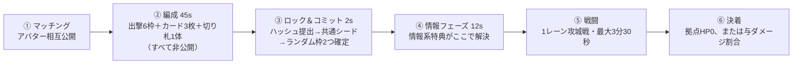

# バトル設計 v0.2（たたき台）

**にゃんこ大戦争型の1レーン攻城戦、1v1。**
アバターが拠点そのもので、ダメージはアバターに入る。相手のアバターのHPを
0にすれば勝ち。

数値は全部仮置きで、調整対象のものは `data/` に JSON で外に出してある
（コードを触らずに数字だけ回せる状態にしておく、が主旨）。

- [0. v0.1から変わったところ](#0-v01から変わったところ)
- [1. 試合の骨格](#1-試合の骨格)
- [2. ユニットの能力](#2-ユニットの能力)
- [3. 編成：6選択＋2ランダム](#3-編成6選択2ランダム)
- [4. 資金](#4-資金)
- [5. 呪文カード](#5-呪文カード)
- [6. 切り札](#6-切り札1試合1回)
- [7. アバターと特典](#7-アバターと特典)
- [8. 公平性と実装](#8-公平性と実装)
- [9. 調整プロセス](#9-調整プロセス)
- [10. 作る順番](#10-作る順番)
- [11. 未決の論点](#11-未決の論点)
- [12. シミュレータ](#12-シミュレータ)
- [13. 見た目](#13-見た目)

---

## 0. v0.1から変わったところ

ジャンルが確定したので、前提を置き直した。

| 何が | v0.1（仮定） | v0.2（確定） |
| --- | --- | --- |
| ジャンル | 1体を操作するアクション | **1レーン攻城戦**（にゃんこ大戦争型） |
| 勝利条件 | 4体KO先取 | **体力制。** 相手アバターのHPを0に |
| アバター | 戦わない。画面端に立つ | **拠点そのもの。ダメージを受ける** |
| 出撃8枠 | 順に出す持ち駒 | **出撃できるユニットの種類。** 何度でも出せる |
| 資源 | ゲージ（カード専用） | **資金。** 出撃と切り札に使う（カードは無料。5章） |
| 切り札 | なし | **別枠1体、1試合1回** |
| 見切り | 相手のため攻撃に合わせる | 相手の**詠唱**に合わせる（窓は0.3秒のまま） |

**アバターが拠点になったのが一番大きい。** v0.1では「戦場に出ないのにアバターと
呼ぶのは据わりが悪い」と書いたが、その問題がまるごと消えた。アバターは
画面端に立っているどころか、**殴られている当事者**になる。

まだ仮定なのは、レーン数（1本）・戦闘の長さ（3分30秒）・拠点HP（10000）・
資金の成長曲線（8段階）。どれも `data/match.json` にある。

---

## 1. 試合の骨格



戦闘中にやることは3つだけ。**資金を払ってユニットを出す**、
**カードを撃つ**、**特典を切る**。ユニットは自動で前進し、自動で戦う。

この骨格を決めている判断は3つ。

**(1) 体力制にした。** 撃破数ではなく拠点HP。押し込んだぶんだけ前に進む
という手触りが1レーン戦の面白さなので、「あと何体」ではなく
「あとどれだけ削れば」で表示する。時間切れは**与ダメージの割合**で決める。

**(2) 8枠は「持ち駒」ではなく「種類」。** 資金が続く限り、
**同じユニットを何体でも同時に出せる**。制限は3つだけ ――
資金、再出撃CD、場の総数（片側30体）。
だから抽選で来た2種類も、*出さないという選択肢がある*。
引き事故が敗北に直結しない。

**(3) 資源は3本あり、時計が別々。** 混ぜないことで、それぞれの判断が独立する。

| 資源 | 何を決めるか | 回復のしかた |
| --- | --- | --- |
| **資金** | 誰を出すか / 育てるか | 毎秒たまる |
| **クールタイム** | いつ戦術を差し込むか | 時間で戻る（資金は使わない） |
| **1試合1回** | 切り札をどこで切るか | 戻らない |

資金で迷うのは**2つだけ**（いま出すか、育てるか）。
「貯めて大技」は3つ目の択ではなく、**高いキャラを選んだ時点で決まっている**
（2.6）。カードは資金を食わないので、この2択に割り込んでこない。

---

## 2. ユニットの能力

キャラクターの強さは、**6つの数字**で決める。特殊効果を足す前に、
まずこの6つだけで役割が立つようにする。

**ユニット個別の特性（そのユニットだけの特殊能力）は入れない。**
全ユニット共通の数字だけで役割を作る。**コストもその数字のひとつ**で、
制約ではなく個性として扱う（2.6）。

| 数字 | 意味 |
| --- | --- |
| **体力** | 耐久。前に居られる時間 |
| **攻撃力** | 1発の威力 |
| **攻撃間隔** | 手数。短いほど攻撃頻度が高い |
| **攻撃発生** | 振り始めてから当たるまで。**長いほど見て対応できる**（2.3） |
| **攻撃範囲** | 当たる**帯**。`[手前, 奥]`（2.1） |
| **貫通** | 1回の攻撃が当たる敵の数。1＝単体。**無限ではない**（2.3） |
| **ノックバック** | 体力をこの数で割った区切りで後退する。1＝後退せずその場で死ぬ（2.3） |
| **移動速度** | **前線がどこで作られるか**を決める（2.2） |
| **対拠点倍率** | 拠点へのダメージ倍率。**これが低いユニットが「壁」**（2.3） |
| **対壁倍率** | 壁に対するダメージ倍率。壁の連鎖を崩すための数字（2.3） |
| **コスト / 再出撃CD** | どれだけ頻繁に出せるか |

**DPSはデータに持たせない。** 攻撃力 ÷ 攻撃間隔 で毎回導出する。
両方書くと必ずどちらかがズレる。

同じユニットは**何体でも同時に場に出せる**。再出撃CDは「次に出せるまで」の
待ち時間であって、場に1体しか置けないという意味ではない。

### 2.1 攻撃範囲は「点」ではなく「帯」

射程を1つの数字にすると、「前線から薙ぐ」と「相手の前線を飛び越えて
後ろを叩く」が区別できない。なので **`[手前, 奥]` の帯**で持たせる。

| 型 | 帯の例 | 何が起きるか |
| --- | --- | --- |
| 接近戦 | `[0, 14]` | 足元だけ |
| **前線範囲** | `[0, 45]` | 足元から前方まで。**群れてきた安いユニットをまとめて薙ぐ** |
| 遠距離 | `[0, 130]` | 死角なしで遠くまで。そのぶん体力を下げる |
| **後方範囲** | `[70, 150]` | **手前70mが死角。** 相手の前線を飛び越えて後衛だけを叩く |

**後方範囲の死角が、戦術の核。** 臼砲は相手の後ろの弓手や砲手を潰せるが、
懐に入られたら一発も撃てない。だから相手は**安い兵卒を1体走らせるだけ**で
臼砲を無力化できる。「強い兵器と、それを潰す最安の答え」が
数字だけで成立する。

### 2.2 移動速度は「前線の位置」

1レーンなので、両軍のユニットはぶつかった場所で戦闘が始まる。
つまり**速度は、戦闘がどこで起きるかを決める**。

- 速いユニットを先に出すと、前線が**相手陣寄り**にできる
  → 相手の後方範囲が死角に入りやすく、自分の遠距離は届きやすい
- 遅いユニットばかりだと前線が**自陣寄り**になる
  → 自分の拠点が射程に入りやすい

「どこで戦うか」を選ぶのが編成と出撃順の意味になる。

### 2.3 あとから足した5つの数字

最初の6つ（体力・攻撃力・攻撃間隔・射程・速度・コスト）だけだと、
「硬い」「痛い」「遠い」しか作れない。**特性を使わずに**役割を増やすために、
共通の数字を5つ足した。

| 数字 | 何が生まれるか |
| --- | --- |
| **攻撃発生** | 大きい一撃ほど振りが長い。**振り始めが見えたら動ける**ので、見切りもカードも「合わせる」対象になる。砲手は撃った直後が狙い目、という遊び方が数字から出る |
| **貫通** | 範囲攻撃を「全部当たる」ではなく**当たる数**にした。薙ぎ払いは6体まで。**それ以上の数で押せば通る**ので、範囲ユニットが絶対の答えにならない |
| **ノックバック** | 体力を何回に割って後退するか。重装（1回＝後退しない）は**線を保つ**、双剣（4回）は**押し戻される**。同じ「硬さ」でも役割が割れる |
| **対拠点倍率** | 重装0.5／臼砲1.5。**押し合いに強いユニットと、拠点を割るのが速いユニット**が別物になる。強いユニットを並べても拠点は落ちない |
| **対壁倍率** | 壁に対する倍率。薙ぎ払い2.2／双剣1.8。**安い壁を並べるだけで前線が保たれる**のを崩すための数字（12.2） |

とくにノックバックと対拠点倍率は、**個別の特性を作らずに役割を分ける**ための
数字として効く。「壁は壁の仕事しかできない」が数字だけで表現できる。

**「壁」に別のタグは付けない。** 壁とは *拠点を割れないユニット* のことで、
対拠点倍率が `wall_threshold`（0.6）以下ならそれが壁。
兵卒（0.5）と重装（0.5）が該当する。すでにある数字の言い換えなので、
新しい種別を増やさずに壁特攻の的が決まる。

**壁の攻撃力は低い。** 壁の仕事は前線を作ることであって殴ることではないので、
兵卒はDPS29、重装は22.5 ―― どちらも全体の中央値（90）を大きく下回る。
`validate.py` が「壁のDPSは中央値以下」を検査する。

### 2.4 数字に置いたルール

`tools/validate.py` が検査する。数字を動かして割ると落ちる。

1. **遠距離（奥50m超）は、死角・体力・手数のどれかを必ず空ける。**
   全部埋まると「近づいても倒せない遠距離」になって詰む。
   砲手は体力を空け、臼砲は死角を空けている。
2. **遠距離は足が遅い。** 速度は全体の中央値以下。
   速い遠距離は、安全な位置を保ったまま前線を押し上げてしまう。
3. **死角を持つユニットは範囲攻撃。** 後方を叩くための兵器なので、
   単体攻撃だと役割が立たず、近づかれた時の弱さだけが残る。
4. **1発の攻撃力が300を超えるユニットは、攻撃発生 0.6秒以上。**
   大きい一撃は必ず読める。反応(0.25秒)＋見切りの窓(0.3秒)より長い。
5. **死角を持つユニットは貫通2以上。** 後方範囲は範囲攻撃で成立させる。
6. **ノックバック1回あたりの耐久は200以上。** 細かすぎると押されっぱなしになる。
7. **壁（対拠点0.6以下）のDPSは中央値以下。** 壁は殴る役ではない。
8. **対壁倍率が1.5を超えるユニットは射程50m以下。** 壁を割るのは、
   壁と同じ距離まで出てきた者の仕事。遠くから安全に溶かせると前に出る理由が消える。
9. **壁と、壁を崩す答えの両方が居ること。** 片方だけだと
   「安い壁を並べるだけ」か「壁が無意味」のどちらかに倒れる。
10. **ティアのコスト帯は重ならない。** 3.2 の鏡像抽選の土台。
11. **再出撃CDは コスト÷25 秒が目安**（±60%）。高いユニットほど連打できない。

### 2.5 ロースター（`data/characters.json`）

**32体。** ティアのコスト帯は重ならない（B 60〜180 / A 200〜380 / S 400〜600）。
役割は全部、2章の数字の組み合わせだけで決まっている。

| 型 | 数 | ユニット |
| --- | ---: | --- |
| **壁** | 5 | 兵卒・盾兵・石壁・重装・土人形 |
| **接近戦** | 7 | 槍兵・爆弾兵・松明持ち・貫き手・長柄兵・火炎兵・薙ぎ払い |
| **高速** | 5 | 斥候鼠・猟犬・双剣・騎兵・狂戦士 |
| **遠距離** | 6 | 投石兵・弩兵・弓手・呪い手・重弩・砲手 |
| **後方範囲** | 2 | 臼砲・大呪術 |
| **大型** | 7 | 攻城弩・影討ち・亡霊将・聖騎士・攻城櫓・巨獣・巨兵 |

型は数字から機械的に決まる（`tools/sprites.py` の `silhouette()` がその判定）。
たとえば「後方範囲」は*攻撃範囲の手前が0より大きい*という条件そのもので、
別のタグを持っているわけではない。

代表的な3体を並べると、足した数字が効いているのが分かる。

| | 体力 | 攻撃力 | 発生 | 攻撃範囲 | 貫通 | KB | 速度 | 対拠点 | 対壁 |
| --- | ---: | ---: | ---: | --- | ---: | ---: | ---: | ---: | ---: |
| 重装（壁） | 3000 | **45** | 0.25s | `[0,14]` | 1 | **1** | 4 | **0.5** | 1.0 |
| 双剣（高速） | 900 | 200 | 0.10s | `[0,13]` | 1 | **4** | 9 | 1.2 | **1.8** |
| 臼砲（後方範囲） | 500 | 480 | 0.80s | `[70,150]` | **8** | 2 | 3 | **1.5** | 0.6 |

重装はノックバック1で線を保つが対拠点0.5で拠点を割れない。
双剣は手数が最大だがノックバック4で押し戻される。
臼砲は死角70mを持つ代わりに、相手の前線を飛び越えて後衛を叩く。
**どれも特性は持っていない。**

ユニットは `family`（人・獣・機械・不死・精霊）も持つが、これは**見た目の区分だけ**で、
数字にも戦闘にも影響しない。系統でシルエットと配色を揃えるためにある（`art/README.md`）。

### 2.6 コストは制約ではなく個性

巨兵の「600」は、弱点でも足かせでもない。
**「この子を使うなら、貯める試合になる」という宣言**である。

だから「いま出すか、貯めて大技を撃つか」は**試合中の択ではない**。
編成でどのキャラを選んだかで、もう決まっている。
兵卒と槍兵で組んだ人は最初から最後まで出し続ける試合をするし、
巨兵を軸にした人は貯める時間を計算に入れた試合をする。

**試合中の択は2つだけ。** いま出すか、育てるか。
3つ目に見えていた「貯める」は、実は編成フェーズで済ませた選択の結果である。

この見方をすると、資金の成長（4章）の意味も変わる。
上限を上げる行為は「速くなる」ことより先に、
**どのキャラの個性を出せるようになるか**の解放になる。

---

## 3. 編成：6選択＋2ランダム

### 3.1 基本

- 所持ユニットから **6種類を選択**。残り **2枠は自動抽選**。合わせて8種類。
- 選択枠＝「固定枠」。情報系特典の対象になる。
- カードデッキ（3枚）と切り札（1体）も同じフェーズで決める。

### 3.2 ランダム枠の公平化：ティア鏡像抽選

素の乱数だと「片方だけ強いユニット2種」が起きる。抽選をこうする：

1. その試合の抽選テンプレートを1つ引く（例 `[A, B]`）。**両者共通**。
2. 各プレイヤーは、固定枠に入れていない自分のユニットから、
   テンプレートのティアに沿って1体ずつ引く。

**変わるのは identity であって power ではない。**
該当ティアの手持ちが足りない場合は共通プールから貸与する（初心者救済も兼ねる）。

### 3.3 抽選シード

```
seed = SHA256( commitA || commitB || matchId )
commitX = SHA256( 選択6種 || デッキ3枚 || 切り札 || nonce )
```

両者がロックするまで相手の commit は開かない。相手の編成を見てから
自分の乱数を回す、といった操作が構造的に不可能になる。

---

## 4. 資金

資金を払うのは**出撃と切り札だけ**。カードは資金を使わない（5章）。
そして資金そのものを**育てられる**（にゃんこ大戦争の働きネコに当たる仕組み）。

### 4.1 成長

資金を払ってレベルを上げると、**所持上限と増加速度が上がる**。
上げるかどうかはプレイヤーが選ぶ。

| Lv | 上限 | 毎秒 | 次へ |
| ---: | ---: | ---: | ---: |
| 1 | 300 | +40 | 200 |
| 2 | 500 | +44 | 350 |
| 3 | 750 | +48 | 550 |
| 4 | 1050 | +52 | 800 |
| 5 | 1400 | +56 | 1100 |
| 6 | 1800 | +60 | 1450 |
| 7 | 2250 | +65 | 1850 |
| 8 | 2800 | +70 | — |

開始は 150。**レベルアップには6秒かかり、その間は出撃もカードも切り札も止まる。**
ここが殴りどころになる。

**伸びが緩いのはわざと。** Lv1→Lv8 で毎秒は 40→70 にしか増えないが、上限は
300→2800 と9倍以上になる。レベルの意味を「速さ」ではなく
**「誰を使えるか」**に寄せてある（2.6 / 4.2）。

**撃破しても資金は入らない。** 倒した相手のコストが返ってくる仕組みは入れていない
―― 守り側が儲かって固まる方向に効くのと、**特定キャラの特性として使いたい**ので、
全体ルールからは外してある。

### 4.2 レベルは「どのキャラを使えるか」

上限が低いうちは、高いユニットが**物理的に出せない**。
つまりレベルを上げる行為は、速度を買うより先に
**キャラの個性を解放する**ことになる（2.6）。

| Lv | 上限 | ここで使えるようになる |
| ---: | ---: | --- |
| 1 | 300 | 兵卒・槍兵・弓手・重装・双剣 |
| 2 | 500 | 薙ぎ払い・臼砲・砲手 |
| 3 | 750 | 巨兵 |
| 4 | 1050 | 切り札 |
| 5〜8 | 〜2800 | （新しく解禁されるものはない。厚みと速さだけ） |

この表は `validate.py` が data から作る。
**最終レベルでしか解禁されないユニットがあると落ちる** ――
そこまで行く試合が少ないと、そのキャラの個性が出てこないので。

### 4.3 育てるか、出すか

**育てている間は何も出せない。** だから兵卒（60）で殴りに行くだけで
相手の成長を止められる。**攻めが弱いと成長が正解になり、
攻めが強いと成長が博打になる**、という関係が資金だけで成立する。

育てきる筋を通すと、到達しうる所持額はこうなる：

| 経過 | 0s | 20s | 40s | 60s | 90s | 120s | 180s |
| --- | ---: | ---: | ---: | ---: | ---: | ---: | ---: |
| 所持額 | 150 | 500 | 750 | 1050 | 1400 | 1800 | 2250 |

`validate.py` は「強化費用がそのレベルの上限を超えていないか」
「最終レベルの上限で全ユニットが出せるか」「切り札が解禁時刻までに
払える額か」を検査する。**出せない設定は事故なので。**

---

## 5. 呪文カード

カードは**戦術の道具**であって、大技ではない。だから**資金を使わない**。
払うのは時間だけ。

### 5.1 ルール

| 項目 | 仕様 |
| --- | --- |
| デッキ | ちょうど **3枚**、同名不可 |
| コスト | **なし。** 資金は1も使わない |
| 使用 | **使い切りではない。** クールタイムが明けたらまた使える |
| 共通クールタイム | 1枚使うと、**12秒**はどのカードも使えない |
| 個別クールタイム | カードごとに 30〜50秒 |
| 詠唱 | 0.5〜0.9秒。**予兆つき**。短縮しても下限 0.35秒（7.5） |
| 公開 | **中身は最初に使うまで非公開。** 未公開の枚数と、使用済みカードの残りCTは常に見える |

**詠唱は残す。** カードが無料になっても、予兆をなくしてはいけない。
見切り（7.5）が合わせる相手はこの詠唱で、ここが消えると特典が丸ごと死ぬ。

**公開の形が変わった。** 以前は「残枚数」だったが、使い切りでなくなったので
**「まだ見せていない枚数」**になる。1枚使えばその中身は割れるので、
*見せるか、隠したまま我慢するか*が新しい駆け引きになる。

### 5.2 物差しは「占有率」

コストが無いので、強さは**効いている時間の割合**で測る。

```
占有率 = 継続時間 ÷ 個別クールタイム
```

- 1枚あたり **15〜30%**
- デッキ3枚の合計は **75%以下**（効きっぱなしにしない）

この2つを `validate.py` が検査する。実際、最初に置いた数字は
**進軍・徴発・号令を積むと80%**になって落ちた。ルールではなく数字を直した。

### 5.3 カード一覧（`data/cards.json`）

**30枚。** 触る対象は7つ（攻撃力 / 攻撃間隔 / 移動速度 / 再出撃CT /
ノックバック / 出撃コスト / 資金の増え方）で、それぞれに
**自軍にかける補助**と**敵軍にかける妨害**、さらに**軽い版と重い版**がある。

| 系統 | 触る数字 | 補助 | 妨害 |
| --- | --- | --- | --- |
| **攻撃** | 攻撃力 | 士気・鬨の声・決死 | 錆・腐食 |
| **攻撃** | 攻撃間隔 | 早撃ち・猛攻 | 鈍化・停滞 |
| **機動** | 移動速度 | 進軍・疾駆 | 泥濘・氷結 |
| **機動** | 再出撃CT | 号令・総動員 | 混乱・分断 |
| **耐久** | ノックバック | 堅陣・踏ん張り・不退転 | 動揺・脆化 |
| **経済** | 出撃コスト | 徴発・大盤振る舞い | 増税・封鎖 |
| **経済** | 資金の増え方 | 増収・金脈 | 枯渇・断絶 |

**軽い版は長く薄く、重い版は短く濃く。** 占有率は 15.6〜24.4% に収まり、
最も濃い3枚を積んでも 72.8%（上限75%）。

**触るのは全部、ユニットが共通で持っている項目**（2章）と資金まわりだけ。
カード専用の仕組みは1つも無い ―― これは `validate.py` が検査している。

---

## 6. 切り札（1試合1回）

出撃8枠とは**別枠**で1体だけ選ぶ、1試合に1回しか出せない特殊ユニット。
強い。位置づけとしてはダイマックスに近く、**強力だが時間制限があり、
両者がその存在を知っている**。

| 項目 | 仕様 | 理由 |
| --- | --- | --- |
| 枠 | 出撃8枠とは別。1体 | 編成を圧迫させない |
| 回数 | **1試合1回** | 使いどころが試合の山場になる |
| 解禁 | 開始 **60秒**後 | 序盤の一撃で終わらせない |
| 召喚 | **3秒の演出** | この間に相手は見て対応できる |
| 中身 | **非公開**。ただし「持っている／使った」は公開 | カードと同じ扱い |
| 退場 | **寿命で消える**（15〜20秒） | 出した瞬間に試合が終わる装置にしない |

**寿命があることが設計の中心。** 1試合1回の最強ユニットが永続すると、
出した時点で勝負が決まってしまう。寿命があると
「この20秒でどれだけ押し込めるか」の勝負になり、
相手にも**耐えきるというプレイ**が残る。

召喚3秒も同じ趣旨で、**中身を隠しつつ不意打ちにはしない**ための時間。
相手はその3秒で、カードを合わせる・防壁を張る・資金を残す、を選べる。

### 6.1 見本（`data/trumps.json`）

| 切り札 | 資金 | 寿命 | 召喚 | 性格 |
| --- | ---: | ---: | ---: | --- |
| 巨神 | 800 | 20s | 3.0s | 超高体力・低速・範囲攻撃。前線を押し切る |
| 疾風の刃 | 700 | 15s | 2.5s | 低体力・超高速。拠点に直行する |
| 大呪術師 | 750 | 18s | 3.0s | 超遠距離・拠点特効。前に出ない |

`validate.py` は「解禁時刻までに貯まる資金で払えるか」「資金上限を
超えていないか」を検査する。**出せないまま試合が終わる切り札**は事故なので。

---

## 7. アバターと特典

**アバター**は拠点そのもの。1人1体、出撃8枠とも切り札とも別枠。
ダメージはここに入り、HPが0になったら負け。

| | |
| --- | --- |
| 何体 | 1人につき **1体** |
| 役割 | **拠点。** 相手の攻撃はここに入る |
| HP | **全アバター共通**（10000）。差は特典だけ |
| 公開 | 試合開始前に相互公開（持っている特典の中身も） |
| 変更 | 試合ごとに自由 |
| 覚え方 | **看板の特典が1つ**（`signature`） |

**HPを共通にするのが重要。** アバターごとにHPを変えると、
特典の予算（下の9〜10pt）が意味を失う。差は特典だけに寄せる。

> ご提示の3案：
> (a) 相手の固定枠が3体ランダムに見える
> (b) 自分のユニットを6種ではなく8種選べる
> (c) 試合中に一度だけ無敵（当初2秒 → **0.3秒**）

この3つは**それぞれ通貨が違う**（情報 / 分散 / 戦闘力）のが設計上の急所。
直感で比べても答えは出ないので、共通の物差しを先に作る。

### 7.1 設計原則

1. **相手にも見える。** アバターはマッチング時に相互公開。持っている特典も公開。
2. **予算は全アバター同じ。** 合計 9〜10pt（`data/perks.json`）。
   カテゴリ上限あり（情報2 / 編成2 / 能動的戦闘1 / テンポ2）。
3. **勝ち筋を増やす特典はOK、相手の選択肢を消す特典はNG。**
4. **使用状況は常に可視。** 「相手の見切り：未使用」は UI に出す。
5. **値段は data で決める。** 直感ではなく計測（9章）で動かす。
6. **数字ではなく手順を変える。** 「アバターによって変わる」が実感できるのは
   *画面や操作が増える*時。**看板の特典は必ず◎**（`validate.py` が検査）。

### 7.2 ご提案3案への評価

| 案 | 評価 | 提案 |
| --- | --- | --- |
| (a) 固定枠3体が見える | **ほぼそのまま採用。** 相手の編成が分かると対策ユニットを出せるので、1レーン戦では v0.1 より価値が上がった | 公開は**両者ロック後**（④）に固定。ロック前だとカウンターピック機になる |
| (b) 6→8種選択 | **そのままだと編成システムを消す。** ランダム枠ゼロ＝3章が丸ごと無効 | **+1枠（6→7）**に縮小。「引き直し」「ティアを1段上げる」も同じ欲求を満たす |
| (c) 無敵 | **0.3秒に確定。** 押せば助かるボタンではなく、読みが当たれば助かる窓 | 合わせる相手が「詠唱」になった。詳細は 7.5 |

### 7.3 カタログ（`data/perks.json`）

| ID | 名称 | 系統 | pt | 手順 | 内容 |
| --- | --- | --- | ---: | :---: | --- |
| `scout_1` | 索敵Ⅰ | 情報 | 5 | ◎ | 相手の固定枠から3種をランダム公開（④で解決） |
| `scout_2` | 索敵Ⅱ | 情報 | 3 | ◎ | 相手の**ランダム枠2種**を公開 |
| `mind_read` | 読心 | 情報 | 4 | ◎ | 相手のカード1枚の**系統だけ**公開 |
| `gauge_sight` | 検算 | 情報 | 2 | — | 相手の**資金**が常時見える |
| `pick_plus` | 選抜+1 | 編成 | 6 | ◎ | 固定枠 6→7（ランダム枠1） |
| `reroll` | 引き直し | 編成 | 4 | ◎ | ランダム枠を1回だけ引き直せる |
| `promote` | 抜擢 | 編成 | 4 | — | ランダム枠の抽選ティアを1段上げる |
| `reserve` | 予備兵 | 編成 | 3 | — | 出撃枠が9種になる |
| `pocket` | 隠し玉 | 編成 | 3 | ◎ | デッキを4枚にできる。1枚は開始時に公開 |
| `late_pick` | 後出し | 編成 | 4 | ◎ | 固定枠1つを保留し④の後に決める（**索敵系と同時不可**） |
| `parry` | 見切り | 戦闘(能動) | 3 | ◎ | 1回だけ、相手のカードを潰す0.3秒の窓（7.5） |
| `surge` | 突撃 | 戦闘(能動) | 5 | ◎ | 自軍全体の前進速度+50%を5秒。2回 |
| `bunker` | 防壁 | 戦闘(能動) | 5 | ◎ | 自拠点の前に2秒の壁。2回 |
| `last_stand` | 起死回生 | 戦闘(受動) | 4 | — | 拠点HPが3割を切ったら1回だけ資金+600 |
| `head_start` | 先手 | テンポ | 3 | — | 開始時資金 +300 |
| `quick_cast` | 詠唱短縮 | テンポ | 5 | — | カード詠唱 -30%（下限0.35秒） |
| `feint` | 空撃ち | テンポ | 3 | ◎ | 詠唱モーションだけ出す（資金0、CD8秒）。**見切りを釣る** |
| `recall` | 追憶 | テンポ | 7 | ◎ | カードのクールタイムを1回だけ即座に戻す |

`late_pick` の `exclusive_with` のように、**同居を禁じる組み合わせ**もデータに書ける。
索敵で見てから枠を埋めるのは事実上のカウンターピックなので、そこは塞いである。

### 7.4 アバター一覧（`data/avatars.json`）

**12体。看板は全員ちがう特典**で、見た目の方向づけ（`look`）を持つ。
`look` は数字に影響しない（`art/README.md`）。

| アバター | look | 看板の特典 | ほか | pt | 性格 |
| --- | --- | --- | --- | ---: | --- |
| 斥候 | 知性 | **索敵Ⅰ** | 検算・空撃ち | 10 | 相手を見てから組み立てる |
| 軍師 | 知性 | **読心** | 検算・引き直し | 10 | カード読みと編成の微調整 |
| 統率 | 王道 | **選抜+1** | 先手 | 9 | 事故を減らす、構築寄り |
| 不動 | 剛力 | **見切り** | 起死回生・検算 | 9 | 大技に合わせて防ぐ |
| 疾風 | 俊敏 | **突撃** | 詠唱短縮 | 10 | 前に出て押し切る |
| 賭博師 | 怪異 | **隠し玉** | 抜擢・先手 | 10 | リスクを取って上振れる |
| 術師 | 知性 | **追憶** | 空撃ち | 10 | カード中心 |
| 豪傑 | 剛力 | **総力戦** | 攻城指揮 | 10 | 一点で押し切る |
| 姫 | 可憐 | **精鋭** | 兵站 | 9 | 軸を1体に決めて回す |
| 職人 | 知性 | **引き直し** | 予備兵・先手 | 10 | 編成を整えて数で回す |
| 獣使い | 可憐 | **索敵Ⅱ** | 手札読み・速攻 | 10 | 勘で相手の中身を当てる |
| 隠者 | 知性 | **情報網** | 検算・後出し | 10 | 相手の手順を読んで待つ |

**隠者の「情報網」は、設計といちばん噛み合った特典。**
*相手がレベルアップを始めた瞬間が分かる* ――
4.3で「育てている6秒が殴りどころ」と決めたその6秒を、特典として拾いに行ける。

`tools/validate.py` が予算・カテゴリ上限・参照整合・看板が◎か・禁止された同居を
機械的に検査する。アバターや特典を足したら必ず通す。

### 7.5 見切り（0.3秒）

| 項目 | 値 | 理由 |
| --- | --- | --- |
| 窓 | 0.30秒（60fpsで18F） | 合わせるための窓 |
| 効果 | **その窓の中で完了した相手のカードを不発にする** | 12.1 参照 |
| 発動 | **startup 0** | 予備動作があると原理的に合わせられない |
| 外した時 | 1回きりの権利を失う ＋ **1秒間なにも出撃できない** | ノーリスクなら連打される |
| 成功時 | ダメージ無効 ＋ **資金 +200** | 防いだだけでは報酬が薄い |
| 回数 | 試合中1回 | 使い切ると相手は自由に大技を通せる |
| コスト | **3pt** | 押すだけでは機能しないので安い |

**合わせる相手は2回変わった。** v0.1では「相手のため攻撃」、v0.2で
「相手の詠唱」。そして実装してみて、**当てる先そのものが無くなっていた**ことが
分かった（12.1）。いまは *詠唱の完了に窓を重ねて、そのカードを不発にする*。

好都合なことに、この特典が要求する条件は v0.1 のまま通る ――
**もともと「詠唱」を相手に書いてあった**から。

- **詠唱は短縮後も 0.35秒を下回らない。** `quick_cast`（0.7倍）を通すと
  反射壁 0.4秒 → 0.28秒 になり、0.3秒の窓で覆えなくなる。
  **特典が別の特典を無効化する**のを防ぐ床（`match.json` の `readability`）。
- **切り札の召喚は3秒。** 反応(0.25秒)＋窓(0.3秒)より十分長い。
- **大型ユニットの攻撃予備動作は0.6秒以上。**
- **ロールバックネットコード。** 0.3秒の読み合いは遅延ベースでは成立しない。

これらは `tools/validate.py` が検査する。数字を動かして条件を割ると落ちる。

**相手側の攻め方。** 見切りが未使用なら、`feint`（空撃ち）で詠唱モーションだけ
出して釣る。使わせてしまえば以降は大技が素通り。**1回きりだからこそ、
いつ切らせるかの勝負**になる。

### 7.6 噛み合い

| ↓が / →に対して | 情報系 | 編成系 | 戦闘系 |
| --- | --- | --- | --- |
| **情報系** | 互角 | **不利**（固定枠が増え情報が薄まる） | 有利（切り札のタイミングを読める） |
| **編成系** | 有利 | 互角 | 互角 |
| **戦闘系** | 不利（切り札を読まれる） | 互角 | 互角 |

---

## 8. 公平性と実装

**非公開情報はクライアントに送らない。** カードの中身・切り札の中身は
サーバーだけが持つ。「送るが表示しない」は必ず抜かれる。
情報系特典は**サーバーが必要な分だけを切り出して**送る。

**乱数はすべてシード由来。** ランダム枠、索敵の対象選択、戦闘乱数まで
3.3 のシードから決定的に導出する。リプレイと不正検証が同じ経路で通る。

**見切り・カード・切り札はサーバー検証。** クライアントは要求を出すだけ。
0.3秒の窓を遅延ベースで同期すると、自分の入力が届く頃には当たりが
終わっているので、**ロールバック必須**。入力はローカルで即反映し、
「無敵の開始フレーム」はサーバー確定値で上書きする。

**特典・ユニット・切り札は完全にデータ駆動。** `perks.json` の1行を消せば
その特典が無効になる状態を維持する（緊急停止スイッチ）。

---

## 9. 調整プロセス

| 指標 | 目標 | 外れた時 |
| --- | --- | --- |
| アバター別勝率 | 50% ±1.5% | pt を上下、または効果量を調整 |
| アバター採用率 | 5〜25% | 5%未満＝弱い / 25%超＝一強 |
| ユニット採用率 | どのティアも 5%以上 | 使われないユニットは数字が悪い |
| 切り札の勝率寄与 | 使用時 +5%以内 | 超えるなら寿命かコストを詰める |
| ランダム枠の勝率寄与 | ±1% 未満 | 3.2 の鏡像抽選が効いていない |

**必ずランク帯別に見る。** 分散を下げる特典（選抜+1）は上位帯ほど強く、
分散を上げる特典（賭博師）は下位帯ほど強い。全体平均だと両方 50% に見えて、
どちらも壊れている、が普通に起きる。

---

## 10. 作る順番

1. **1レーンの戦闘だけ。** ユニット3種類、資金、拠点HP。
   カードもアバター特典も切り札も無し。
   **ここが面白くなければ、上に何を乗せても面白くならない。**
2. **ユニットを8種類に増やす。** 2章の6つの数字だけで役割が立つか。
   特殊効果はまだ足さない。
3. **編成フェーズ**（6選択＋2ランダム、鏡像抽選、commit-reveal）。
4. **カード3枚**（残枚数公開、詠唱、予兆）。
5. **切り札**。寿命と召喚演出が読み合いになっているか。
6. **アバター特典**。まず情報系1つ（索敵Ⅰ）だけ入れて、
   フェーズ設計が壊れないかを見る。

---

## 11. 未決の論点

- **成長の導入をどうするか。** 資金で迷うのは2つ（出す／育てる）に整理できたが、
  「育てる」の価値は初見には見えにくい。**最初の数試合だけ成長を自動にする**
  などの導入が要るかもしれない。
- **カードが無料になったので、撃たない理由がほとんどない。** クールタイムが
  明けたら撃つのが最適、になっていないか。「中身を見せたくない」だけが
  我慢する理由になっているが、それで足りるかは実測が要る。
- **rush（一切育てない）が依然として最弱**（−0.31）。資金のどの数字を
  振っても −0.5〜−0.3 から動かなかったので、これは構造的な差。5分の試合で
  投資を放棄する戦法が弱いのは妥当かもしれないが、成立させたいなら
  別の軸（序盤限定の割引など）が要る。
- **測定に使っている方針が粗い。** 「壁が2体未満なら最安、それ以外は最も高い
  ものを出す」程度なので、上手い rush ならもっとやれる可能性は残っている。
- **レーンを1本のままにするか。** 1本は読みやすいが、2本にすると
  「どちらを守るか」が生まれる。まず1本で作って判断したい。
- **切り札の中身を非公開のままにするか。** 3秒の召喚演出があるので
  不意打ちにはならないが、編成段階から見えていたほうが読み合いは深くなる。
- **見切りの成功報酬。** 資金+200 で足りるか、相手の詠唱を潰すところまで
  付けるか。潰すまで付けると1回の読みで試合が動きすぎる恐れがある。
- **次に足すとしたら何か。** 個別の特性は入れない方針のまま増やせる
  共通の数字として、**占有幅**（隊列が作れるが1レーンだと窮屈）、
  **出現ラグ**（出撃ボタンから登場までの間。コストに比例させると先読みが要る）、
  **狙う優先度**（前から／後ろから／体力の低い順。ただしこれは事実上の特性に近い）
  が候補。いまは足していない。
- **アバターの入手方法。** 課金で買えると 7.1 の原則1・2があっても
  「金で情報を買う」構図になる。全アバターを無料開放し、
  課金は見た目に寄せるのが安全。

---

## 12. シミュレータ

10章の1〜5（1レーンの戦闘・資金・カード・切り札）を実装した。`game/engine/`。

```console
$ python3 -m game.engine --a rush --b greed      # 1試合
$ python3 -m game.engine --all --repeat 20       # 総当たり
$ python3 -m game.engine --timeline              # 起きたこと全部
$ python3 game/tools/validate.py                 # data の検査
$ python3 -m unittest discover -s game/tests -t .
```

決めごとは3つ。

- **数値をコードに書かない。** 全部 `data/*.json` から来る。バランス調整で
  Python を触ることは無い。
- **決定論。** 固定タイムステップ。同じ入力からは必ず同じ試合になる（8章）。
- **両者が同じ盤面を見る。** tickの頭で盤面を固定し、両者の判断と
  ダメージをまとめて適用する。

### 12.1 書いてみて分かったこと

紙の上では見えていなかったことが3つ出た。

**(1) 見切りに当てる相手がいなくなっていた。**
5章でカードを「時間つきの補助と妨害」にした時点で、カードはダメージを
出さなくなった。なのに見切りは「0.3秒の無敵」のままで、
*無敵になっても防ぐものが無い*。合わせる読み合いだけが残って、
効果が空になっていた。
→ **相手のカードを不発にする**（窓が詠唱の完了を覆えば、クールタイムだけ
払わせて効果を消す）に変えた。反応可能性の契約（詠唱の床0.35秒）は
そのまま効く。

**(2)「育てている間は何も出せない」がルールになっていなかった。**
4.3にそう書いてあるのに、レベルアップは**一瞬**で終わる仕様だった。
つまり殴りに行っても止められない。文章だけが正しくて、
数字がその通りになっていなかった。
→ `upgrade_sec: 3.0` を入れ、その間は出撃もカードも切り札も止まるようにした。

**(3) それでも資金を育てる方が強い。** 下の表のとおり。

### 12.2 バランス調整（壁と資金）

**測り方を変えた。** 勝敗の0/1は分散が大きすぎて、6試合では数字が
83%→44%→83% と跳ねて何も読めなかった。**拠点への与ダメージ差**という
連続量に変えたら、同じ試合数で安定した信号が出るようになった。

指標は「その方針が、他の方針を相手にどれだけ拠点を削り勝つか」。
`+1.0` で完勝、`0` で互角。

| | rush（Lv2） | balanced（Lv4） | greed（Lv6） | ばらつき |
| --- | ---: | ---: | ---: | ---: |
| **調整前** | −0.67 | +0.00 | **+0.67** | 1.33 |
| **調整後** | −0.31 | **+0.45** | −0.14 | 0.76 |

**一番の変化は形。** 調整前は「育てるほど強い」が完全に単調で、
資金レベルの選択が択になっていなかった。調整後は **balanced（Lv4）が頂点**で、
**育てすぎ（Lv6）は損**になる。山が内側にある＝選ぶ意味がある。

**効いた順に：**

| 変更 | 効果 |
| --- | --- |
| **戦闘を3分30秒に短縮**（5分から） | 複利の効く時間が減り、rush が −0.46→−0.30。設計書0章の「想定4〜5分」と実際が6分だったズレも同時に直った |
| **レベルアップに6秒**（3秒から） | 育てている隙が実際に殴れる長さになった |
| **資金の伸びを緩く**（毎秒 30→160 を 40→70 へ） | レベルの意味が「速さ」から「誰を使えるか」に寄った |
| **壁特攻の追加と壁の弱体化** | 壁の連鎖が崩せるようになった（下記） |

**効かなかったもの。** 撃破報酬（0.4→0.15→0）は**結果を1%も動かさなかった**。
守り側が儲かって固まる、という読みは外れていた。
拠点HPを下げるのも rush を**助けなかった**（−0.46→−0.57 と悪化）。
拠点が脆いと、後半に火力が出る側のほうが得をするため。

### 12.3 壁が強すぎた件

12.2以前の版では、**兵卒（60）を出し続けるだけで前線が保たれ**、
育てている側が一切殴られなかった。これを3つで直した。

1. **壁を数字で定義した。** 壁＝対拠点倍率が 0.6 以下＝拠点を割れないユニット。
   別のタグは足していない（2.3）。
2. **壁の攻撃力を下げた。** 兵卒 60→35、重装 70→45。壁の仕事は前線を作ること。
3. **壁特攻を全ユニット共通の数字として足した。** 薙ぎ払い2.2／双剣1.8。
   ただし**射程50m以下に限る** ―― 遠くから安全に壁を溶かせると、
   前に出る理由が消えるので。

`validate.py` が「壁が居ること」「壁を崩す答えが居ること」の両方を検査する。
片方だけだと、安い壁を並べるだけの試合になるか、壁が意味を失うかのどちらかに倒れる。

### 12.4 潰した2つの不具合

どちらも「片方の側が有利」という形でバランスの数字を汚すもので、
**左右対称の試合が引き分けにならない**ことで見つかった。

- **tick内の処理順。** 先に処理される側が先に殴れていた。同じミラー戦で
  先手が95%勝つ、という値が出て気づいた。両者ぶんのダメージを
  まとめて適用するようにした。
- **浮動小数点の比較。** 左右のユニットは逆向きに動くので、同じ地点でも
  下位桁が一致しない。素で比較していたため「前の味方に詰まるか」の判定が
  **1e-16 の差でひっくり返り**、片側だけユニットが前に出ていた。
  許容差（1e-6）を入れた。

いまは3つの方針すべてで、完全同一編成のミラー戦が引き分けになる。
`game/tests/test_engine.py` が回帰テストとして持っている。

### 12.5 まだ実装していないもの

情報系の特典（索敵・読心・検算）は編成と読み合いの話で、戦闘の数字には
効かないので入れていない。編成系（選抜+1・引き直し・抜擢・予備兵・隠し玉・
後出し）は3章のドラフト側の話。防壁・空撃ち・追憶は未実装。
`--timeline` を付けない実行の末尾に、その試合で効いていない特典が出る。

---

## 13. 見た目

指針は [`art/README.md`](art/README.md)。方針の中心は
**数字と見た目を紐づける**こと ―― 対拠点倍率が低ければ盾を持ち、
攻撃範囲に死角があれば砲身が上を向き、射程が長ければ得物が長い。
初見の人が**見ただけで役割を当てられる**状態を目指す。

参照は3つ。**ドラクエ**から系統でシルエットを共有する作り、
**にゃんこ大戦争**から横向き固定とシルエット優先、
**ポケモン**から役割が色で分かる配色を採る。

解像度は ユニット48×48 / 拠点64×64 / 切り札96×96。
6色1組のパレットを全系統で固定する。

`tools/sprites.py` が data から**仮のドット絵を生成する**（依存なし）。
本番の絵ではなく、(1) 試遊版に今すぐ何かを映せるようにするため、
(2) 上の規約を文章ではなく実行できる形にしておくため。

```console
$ python3 game/tools/sprites.py
ユニット 32 / アバター 12 を game/art/out に書き出した
シルエットの内訳: melee 7 / heavy 7 / ranged 6 / wall 5 / fast 5 / mortar 2
```

**攻撃アニメの配分は `attack_windup_sec` に一致させる。**
ここがずれると、7.5の「振り始めが見えたら反応できる」という約束が絵の側で破れる。
