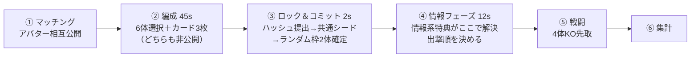

# バトル設計 v0.1（たたき台）

1v1 対戦の骨格・呪文カード・**アバター特典**の設計。
数値は全部仮置きで、調整対象のものは `data/` に JSON で外に出してある
（コードを触らずに数字だけ回せる状態にしておく、が主旨）。

- [0. 前提（要確認）](#0-前提要確認)
- [1. 試合の骨格](#1-試合の骨格)
- [2. 編成フェーズ：6選択＋2ランダム](#2-編成フェーズ6選択2ランダム)
- [3. 呪文カード](#3-呪文カード)
- [4. アバター特典](#4-アバター特典本題)
- [5. 公平性と実装](#5-公平性と実装)
- [6. 調整プロセス](#6-調整プロセス)
- [7. 作る順番](#7-作る順番)
- [8. 未決の論点](#8-未決の論点)

---

## 0. 前提（要確認）

プロトタイプの「動き」を私は見ていないので、以下は**仮定**。ここがズレていると
4章のコスト付けが全部ズレるので、最初に潰したい。

| 項目 | 本書の仮定 | 確認したいこと |
| --- | --- | --- |
| 操作形式 | 1体を直接操作するリアルタイムアクション | 全員同時に動く？1体ずつ？ |
| 試合形式 | 1v1、8体編成・**4体KO先取** | 全滅制にする？ |
| 交代 | KOされたら次の1体を**自分で選んで**出撃 | 順番固定にする？ |
| 想定試合長 | 編成込みで 4〜5分 | もっと短くしたい？ |
| ネットコード | **サーバー権威**（非公開情報があるので必須） | P2P 前提なら 5章の別案へ |
| ロースター規模 | 20体以上 | 「6体選んで残りランダム」は母数が少ないと成立しない |

---

## 1. 試合の骨格



この骨格を決めている判断は3つ。

**(1) 8体編成だが、全部は出ない（4体KO先取）。**
8体全員を戦わせると試合が長いうえ、ランダム枠2体が必ず戦場に出てしまう。
4体先取なら「誰を出すか」の選択が毎試合発生し、ランダム枠は
*出さないという選択肢がある戦力*になる。事故がそのまま敗北にならない。

**(2) ランダム枠は「戦力差」ではなく「識別子」。**
ランダムの役目は、毎試合ちがう顔ぶれにして最適解編成の固定化を防ぐこと。
勝敗を決めさせてはいけない。→ 2章の鏡像抽選。

**(3) 非公開情報は3種類だけ。**
カードの中身 / 出撃順 / 特典を切るタイミング。これ以上増やすと
「見えないところで負けた」が発生する。**残枚数・特典の使用済みフラグは常に公開**。

---

## 2. 編成フェーズ：6選択＋2ランダム

### 2.1 基本

- 所持キャラから **6体を選択**。残り **2枠は自動抽選**。合計8体。
- 選択枠＝「固定枠」。ここが情報系特典の対象になる。
- カードデッキ（3枚）も同じフェーズで決める。→ 3章。

### 2.2 ランダム枠の公平化：ティア鏡像抽選

素の乱数だと「片方だけ強キャラ2体」が起きる。抽選をこうする：

1. キャラは事前に **ティア（S / A / B）** を持つ（コスト概念）。
2. その試合の抽選テンプレートを1つ引く（例 `[A, B]`）。**両者共通**。
3. 各プレイヤーは自分の所持キャラのうち固定枠に入れていないものから、
   テンプレートのティアに沿って1体ずつ引く。

これで「引きの内容（＝相性・役割）」は毎試合変わるが、「引きの総戦力」は
両者ほぼ同じになる。**変わるのは identity であって power ではない**、という原則。

補足：所持キャラが少ないプレイヤーが不利にならないよう、該当ティアの手持ちが
足りない場合は共通プールから貸与する（初心者救済も兼ねる）。

### 2.3 抽選シード

抽選はサーバーが持つが、乱数を疑われないように commit-reveal を挟む：

```
seed = SHA256( commitA || commitB || matchId )
commitX = SHA256( 選択6体 || デッキ3枚 || nonce )
```

両者がロックするまで相手の commit は開かない。片側だけ引き直す、
相手の編成を見てから自分の乱数を回す、といった操作が構造的に不可能になる。

---

## 3. 呪文カード

### 3.1 ルール

| 項目 | 仕様 |
| --- | --- |
| デッキ | ちょうど **3枚**、同名不可 |
| 公開 | **中身は非公開**。ただし**残枚数は常に相手に見える**（3→2→1） |
| 使用 | ゲージを消費して発動。使い切り |
| ゲージ | 上限100 / 毎秒+8 / 与ダメ100につき+6 / 味方KO時+20 |
| 詠唱 | 0.4〜0.8秒。**足元にサークル＋固有SE**。反応可能にする |
| 構築制限 | デッキ合計コスト **170以下**（大技3枚積みの禁止） |

「残枚数だけ公開」がこのシステムの肝。**何を持っているかは分からないが、
あと何回来るかは分かる**。ここが読み合いになる。全部隠すと理不尽、
全部見せると駆け引きが消える。

### 3.2 サンプル（`data/cards.json`）

| カード | コスト | 詠唱 | 効果 |
| --- | ---: | ---: | --- |
| 火柱 | 50 | 0.6s | 前方に炎柱、中ダメージ |
| 治癒の光 | 40 | 0.8s | 自HP +30% |
| 時縛 | 70 | 0.7s | 相手を1.2秒足止め |
| 影分身 | 60 | 0.5s | 分身1体を8秒生成 |
| 反射壁 | 55 | 0.4s | 2秒間、投射物を反射 |
| 呼び戻し | 80 | 1.0s | KOされた味方1体をHP40%で復帰 |

「呼び戻し」は 4体KO先取に直接効く＝実質1KO分。だから最高コストかつ
詠唱1.0秒（＝止められる）にしてある。強いカードは**長い予兆**で払わせる。

---

## 4. アバター特典（本題）

> ご提示の3案：
> (a) 相手の固定枠が3体ランダムに見える
> (b) 自分のキャラを6体ではなく8体選べる
> (c) 試合中に一度だけ2秒無敵

この3つは**それぞれ通貨が違う**（情報 / 分散 / 戦闘力）のが設計上の急所。
「どれが強いか」を直感で比べても答えは出ないので、共通の物差しを先に作る。

### 4.1 設計原則

1. **相手にも見える。** アバターはマッチング時に相互公開。持っている特典も公開。
   隠れた非対称性を作らない（隠すと情報系特典が一方的に強くなる）。
2. **予算は全アバター同じ。** 合計 9〜10pt（`data/perks.json`）。
   カテゴリ上限あり（情報2 / 編成2 / 能動的戦闘1 / テンポ2）。
3. **勝ち筋を増やす特典はOK、相手の選択肢を消す特典はNG。**
   「相手のキャラを1体BANする」系は入れない。
4. **使用状況は常に可視。** 「相手の無敵：未使用」は UI に出す。
   見えない切り札は理不尽、見える切り札は読み合い。
5. **値段は data で決める。** 直感ではなく計測（6章）で動かす。

### 4.2 ご提案3案への評価

| 案 | 評価 | 提案 |
| --- | --- | --- |
| (a) 固定枠3体が見える | **ほぼそのまま採用。** 情報は上振れしないので価格が安定する良い特典 | 公開タイミングを**両者ロック後**（④情報フェーズ）に固定。ロック前に見えるとカウンターピック機になって別ゲーになる |
| (b) 6体→8体選択 | **そのままだと編成システムを消す。** ランダム枠ゼロ＝2章が丸ごと無効になり、上位帯ほど有利（分散を消せるのは強者の特権） | **+1枠（6→7）**に縮小。「ランダム枠を1回引き直せる」「抽選ティアを1段上げる」も同じ欲求を満たしつつシステムを壊さない |
| (c) 2秒無敵 | **2秒は長い。** 格ゲーの無敵は0.3〜0.6秒。2秒あると「とりあえず押す」で読み合いが消える | 2秒を残すなら **無敵中は攻撃不可**（純粋な防御ボタンにする）。攻撃も通したいなら **1.2秒**。どちらでも可、両方はダメ |

(a) と (b) の噛み合いも面白くて、**(b) の相手には (a) が弱くなる**
（固定枠が7〜8に増えるので3体見ても比率が下がる）。逆に (a) はランダム枠が
多い相手に対しては情報価値が下がる。放っておいても三すくみができる。

### 4.3 カタログ（`data/perks.json`）

| ID | 名称 | 系統 | pt | 内容 |
| --- | --- | --- | ---: | --- |
| `scout_1` | 索敵Ⅰ | 情報 | 5 | 相手の固定枠から3体をランダム公開（④で解決） |
| `scout_2` | 索敵Ⅱ | 情報 | 3 | 相手の**ランダム枠2体**を公開 |
| `mind_read` | 読心 | 情報 | 4 | 相手のカード1枚の**系統だけ**公開（名前は伏せる） |
| `gauge_sight` | 検算 | 情報 | 2 | 相手のゲージ量が常時見える |
| `pick_plus` | 選抜+1 | 編成 | 6 | 固定枠 6→7（ランダム枠1） |
| `reroll` | 引き直し | 編成 | 4 | ランダム枠を1回だけ引き直せる |
| `promote` | 抜擢 | 編成 | 4 | ランダム枠の抽選ティアを1段上げる |
| `reserve` | 予備兵 | 編成 | 3 | 編成9体（選択6＋ランダム3）。先取数は4のまま |
| `immortal` | 不動 | 戦闘(能動) | 6 | 1回だけ2秒無敵。**無敵中は攻撃不可** |
| `escape` | 緊急離脱 | 戦闘(能動) | 5 | 0.8秒無敵＋後退、2回 |
| `last_stand` | 起死回生 | 戦闘(受動) | 4 | 残り1体になった時、初回のみ最大HP+20% |
| `head_start` | 先手 | テンポ | 3 | 開始時ゲージ +30 |
| `quick_cast` | 詠唱短縮 | テンポ | 5 | カード詠唱 -30% |
| `recall` | 追憶 | テンポ | 7 | 使用済みカード1枚を1回だけ再使用（コスト2倍） |

### 4.4 アバター例（`data/avatars.json`）

| アバター | 構成 | pt | 性格 |
| --- | --- | ---: | --- |
| 斥候 | 索敵Ⅰ＋検算＋先手 | 10 | 相手を見てから組み立てる |
| 軍師 | 読心＋検算＋引き直し | 10 | カード読みと編成の微調整 |
| 統率 | 選抜+1＋先手 | 9 | 事故を減らす、構築寄り |
| 不動 | 不動＋起死回生 | 10 | 詰めの一回を耐える |
| 疾風 | 緊急離脱＋詠唱短縮 | 10 | 手数と回避 |
| 賭博師 | 抜擢＋予備兵＋先手 | 10 | 分散を上げて殴る |
| 術師 | 追憶＋先手 | 10 | カード中心 |

`tools/validate.py` が予算・カテゴリ上限・参照整合を機械的に検査する。
特典を足したら必ず通す。

### 4.5 噛み合い

| ↓が / →に対して | 情報系 | 編成系 | 戦闘系 |
| --- | --- | --- | --- |
| **情報系** | 互角（互いに見える） | **不利**（固定枠が増え情報が薄まる） | 有利（無敵の使い所を読める） |
| **編成系** | 有利 | 互角 | 互角 |
| **戦闘系** | 不利（切り札のタイミングを読まれる） | 互角 | 互角 |

意図的に一直線の強弱にせず、三すくみ気味にしてある。

---

## 5. 公平性と実装

**非公開情報はクライアントに送らない。** カードの中身・出撃順は
サーバーだけが持つ。「送るが表示しない」は必ず抜かれる。
情報系特典は**サーバーが必要な分だけを切り出して**送る
（索敵Ⅰなら、公開対象3体の情報のみ）。

**乱数はすべてシード由来。** ランダム枠、索敵の対象選択、
クリティカル等の戦闘乱数まで 2.3 のシードから決定的に導出する。
リプレイ再生と不正検証が同じ経路で通る。

**無敵・カードはサーバー検証。** クライアントは要求を出すだけで、
成立判定はサーバー。ロールバック方式なら「無敵の開始フレーム」は
必ずサーバー確定値で上書きする（見た目のズレは許容、判定のズレは不可）。

**特典は完全にデータ駆動。** `perks.json` の1行を消せば、その特典が
その場で無効になる状態を維持する（緊急停止スイッチ）。

---

## 6. 調整プロセス

特典の値段は事前に正解が出ない。出荷後に測って動かす前提で作る。

| 指標 | 目標 | 外れた時 |
| --- | --- | --- |
| アバター別勝率 | 50% ±1.5% | pt を上下、または効果量を調整 |
| アバター採用率 | 5〜25% | 5%未満＝弱い / 25%超＝一強 |
| 特典の発動率 | 能動系は 70%以上 | 使われない＝噛み合っていない |
| ランダム枠の勝率寄与 | ±1% 未満 | 2.2 の鏡像抽選が効いていない |

**必ずランク帯別に見る。** 分散を下げる特典（選抜+1）は上位帯ほど強く、
分散を上げる特典（賭博師）は下位帯ほど強い。全体平均だと両方 50% に見えて、
どちらも壊れている、が普通に起きる。

---

## 7. 作る順番

1. **戦闘だけ**（8体・4体先取・交代あり）。カードもアバターも無し。
   ここが面白くなければ、上に何を乗せても面白くならない。
2. **編成フェーズ**（6選択＋2ランダム、鏡像抽選、commit-reveal）。
3. **カード3枚**（残枚数公開、ゲージ、詠唱）。読み合いが成立するか。
4. **アバター特典**。まず情報系1つ（索敵Ⅰ）だけ入れて、
   フェーズ設計が壊れないかを見る。壊れなければ残りを流し込む。

キャラとモーションの追加は 1 と並行で足していける（データ駆動なので）。

---

## 8. 未決の論点

- **出撃順を非公開にするか。** 非公開だと読み合いが増えるが、情報が3種類から
  増える。個人的には非公開のままが良いと思うが、テストで確認したい。
- **アバターの入手方法。** 課金で買えると 4.1 の原則1・2があっても
  「金で情報を買う」構図になる。全アバターを無料開放し、
  課金は見た目に寄せるのが安全。
- **索敵Ⅰの対象選択。** 完全ランダム3体か、「1体は指名＋2体ランダム」か。
  後者はプレイヤーの意思が入って気持ちいいが、pt が上がる。
- **カード構築制限（合計170）の妥当性。** サンプル6枚では検証できない。
  最低20枚は必要。
- **ランダム枠のティア定義。** キャラを S/A/B に分ける基準そのものが
  バランス調整の本体になる。誰がどう決めるか。
